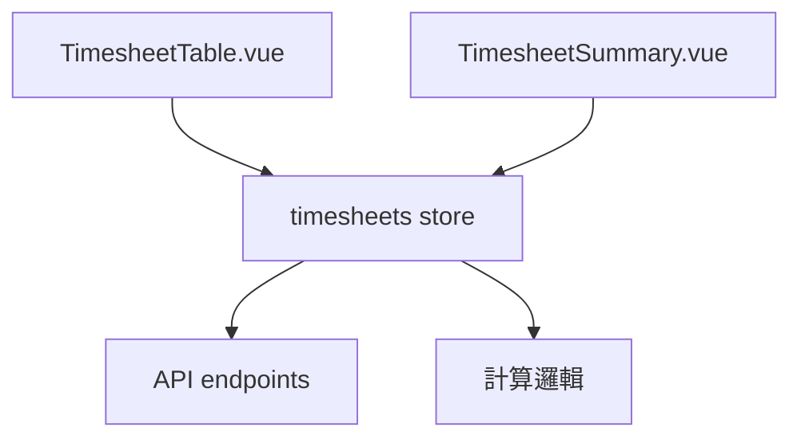

# Design Document: BR6.3: 工時顯示功能

## Overview

工時顯示功能提供請假記錄顯示、工時完整性檢查和統計功能，增強工時表格的資訊展示能力，幫助員工了解工時狀況。

## Steering Document Alignment

### Technical Standards (tech.md)
- 使用 Vue 3 Composition API 進行組件開發
- 使用 Ant Design Vue 組件庫保持 UI 一致性
- 遵循現有的組件命名和結構規範

### Project Structure (structure.md)
- 組件放在 `src/components/timesheets/` 目錄
- Store 邏輯放在 `src/stores/timesheets.js`
- 遵循現有的文件命名規範（PascalCase 組件，camelCase 文件）

## Code Reuse Analysis

### Existing Components to Leverage

- **TimesheetTable.vue**: 工時表格組件（已有，需增強表尾顯示）
- **TimesheetSummary.vue**: 統計組件（已有）
- **Ant Design Vue Table**: 使用現有的 Table 組件進行表格展示
- **Ant Design Vue Card/Statistic**: 使用現有的統計卡片組件

### Integration Points

- **請假記錄**: 從 `src/stores/timesheets.js` 的 `leaves` Map 獲取
- **統計數據**: 從 `src/stores/timesheets.js` 的 `weeklySummary` 和 `monthlySummary` 獲取
- **工時數據**: 從 `src/stores/timesheets.js` 的 `timesheets` 獲取
- **工作日判斷**: 使用現有的工作日計算邏輯

## Architecture

工時顯示功能採用組件化架構，將顯示邏輯與計算邏輯分離：

- **展示層**: TimesheetTable 和 TimesheetSummary 組件負責 UI 展示
- **邏輯層**: Store 中的計算函數負責統計和完整性檢查
- **數據層**: Store 管理工時和請假數據的狀態

### Modular Design Principles
- **Single File Responsibility**: TimesheetTable 負責表格顯示，TimesheetSummary 負責統計展示
- **Component Isolation**: 表尾顯示邏輯封裝在 TimesheetTable 內部
- **Service Layer Separation**: 統計計算邏輯在 store 中，與 UI 分離
- **Utility Modularity**: 工作日判斷、時數計算等邏輯可抽取為工具函數



## Components and Interfaces

### TimesheetTable (表尾增強)

- **Purpose**: 在表格底部顯示請假記錄和工時完整性
- **Location**: `src/components/timesheets/TimesheetTable.vue`
- **Interfaces**: 
  - Props: `timesheets` (Array) - 工時記錄數組, `leaves` (Map) - 請假記錄 Map（key: date, value: Array of leave records）, `dates` (Array) - 日期數組
  - Methods: 
    - `getLeaveDisplay(date: string): string` - 格式化請假記錄顯示，返回格式化的字符串或 `-`
    - `getCompletenessStatus(date: string): string` - 計算工時完整性狀態，返回 `✓`、`✗缺X.Xh` 或 `-`
- **Dependencies**: Ant Design Vue Table, timesheets store
- **Reuses**: 現有的 TimesheetTable 組件結構

### TimesheetSummary

- **Purpose**: 顯示本週和本月統計
- **Location**: `src/components/timesheets/TimesheetSummary.vue`
- **Interfaces**: 
  - Props: 
    - `weeklySummary` (Object) - 本週統計對象，包含 totalHours, overtimeHours, weightedHours, leaveHours
    - `monthlySummary` (Object) - 本月統計對象，包含 totalHours, overtimeHours, weightedHours, leaveHours
- **Dependencies**: Ant Design Vue Card, Statistic
- **Reuses**: 現有的 TimesheetSummary 組件結構

## Data Models

### Leave Record
```
- date: string (YYYY-MM-DD) - 請假日期
- type: string (請假類型) - 例如：病假、事假、特休等
- hours: number (請假時數) - 請假的小時數
```

### Weekly Summary
```
- totalHours: number (總工時) - 本週所有工時總和
- overtimeHours: number (加班工時) - 本週加班工時總和
- weightedHours: number (加權工時) - 根據 multiplier 計算的加權工時
- leaveHours: number (請假時數) - 本週請假時數總和
```

### Monthly Summary
```
- totalHours: number (總工時) - 本月所有工時總和
- overtimeHours: number (加班工時) - 本月加班工時總和
- weightedHours: number (加權工時) - 根據 multiplier 計算的加權工時
- leaveHours: number (請假時數) - 本月請假時數總和
```

## Error Handling

### Error Scenarios
1. **請假記錄缺失**: 當某日請假記錄不存在時
   - **Handling**: 顯示 `-`，不影響其他功能
   - **User Impact**: 用戶看到 `-` 標記

2. **統計計算失敗**: 當統計數據計算出錯時
   - **Handling**: 顯示錯誤訊息，使用預設值 0
   - **User Impact**: 用戶看到錯誤提示或預設值

3. **工作日判斷失敗**: 當無法判斷是否為工作日時
   - **Handling**: 預設為非工作日，顯示 `-`
   - **User Impact**: 工時完整性顯示 `-`

## Testing Strategy

### Unit Testing
- 測試統計計算函數的準確性
- 測試請假記錄格式化邏輯
- 測試工時完整性判斷邏輯

### Integration Testing
- 測試組件與 store 的數據流
- 測試表尾顯示與表格數據的同步

### End-to-End Testing
- 測試完整工時頁面載入和顯示
- 測試統計數據的實時更新

