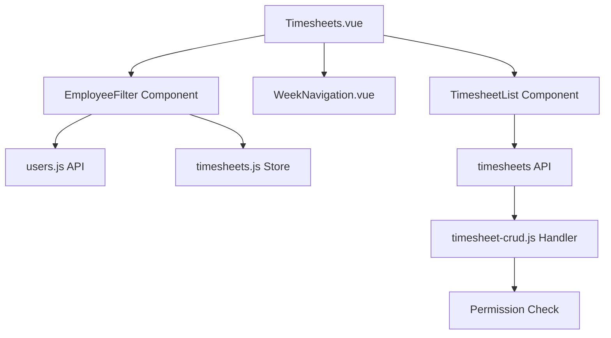

# Design Document: BR6.4: 工時管理功能

## Overview

工時管理功能提供管理員查看和管理員工工時記錄的功能。本功能擴展現有的工時記錄系統，添加員工篩選和權限控制能力，確保管理員可以管理所有員工的工時記錄，而普通員工只能查看自己的記錄。

## Steering Document Alignment

### Technical Standards (tech.md)
- 遵循 Vue 3 Composition API 模式
- 使用 Ant Design Vue 組件庫保持 UI 一致性
- 後端使用 Cloudflare Workers 環境
- 遵循現有的 API 設計模式

### Project Structure (structure.md)
- 組件放置在 `src/components/timesheets/` 目錄
- 視圖組件放置在 `src/views/` 目錄
- Store 管理放置在 `src/stores/` 目錄
- 後端處理器放置在 `backend/src/handlers/timesheets/` 目錄

## Code Reuse Analysis

### Existing Components to Leverage

- **WeekNavigation.vue**: 週導航組件（已有，已包含員工篩選插槽 `#employee-filter`）
- **Timesheets.vue**: 主頁面組件（已有，現有實現直接在插槽中使用 Select 組件，需重構為獨立 EmployeeFilter 組件）
- **Select 組件**: Ant Design Vue 的 Select 組件用於員工篩選下拉框
- **timesheets store**: 現有的 store 已包含 `selectedUserId`、`users`、`isAdmin` 狀態和 `setSelectedUserId`、`fetchUsers` 方法

### Integration Points

- **員工列表 API**: 從 `src/api/users.js` 獲取員工列表（store 中已有 `fetchUsers` 方法）
- **權限控制**: 從 `src/stores/timesheets.js` 的 `isAdmin` 狀態獲取當前用戶權限（已通過 `fetchCurrentUser` 設置）
- **工時記錄 API**: 現有的工時記錄 API 已支援員工 ID 參數（`user_id`），store 中的 `fetchTimesheets` 已使用該參數
- **Store 狀態管理**: 現有的 `src/stores/timesheets.js` 已包含 `selectedUserId`、`users`、`isAdmin` 狀態和 `setSelectedUserId`、`fetchUsers`、`loadAllData`（含預設選擇邏輯）方法

## Architecture

本功能採用前端組件擴展和後端權限驗證的雙層架構：

1. **前端層**: 在現有 Timesheets 視圖中重構員工篩選為獨立組件（現有實現直接在插槽中使用 Select），通過 Store 管理選中狀態（已實現）
2. **API 層**: 現有工時記錄 API 已支援員工 ID 查詢參數（`user_id`），store 中的 `fetchTimesheets` 已使用該參數
3. **後端層**: 處理器中已實現權限驗證（`handleGetTimesheets` 第22-29行），確保非管理員只能查詢自己的記錄

### Modular Design Principles
- **Single File Responsibility**: 員工篩選邏輯封裝在獨立組件中
- **Component Isolation**: 篩選組件可獨立測試和重用
- **Service Layer Separation**: API 調用與 UI 邏輯分離
- **Utility Modularity**: 權限檢查邏輯封裝為可重用工具



## Components and Interfaces

### EmployeeFilter Component

- **Purpose**: 提供員工篩選下拉框，僅管理員可見
- **Location**: `src/components/timesheets/EmployeeFilter.vue`
- **Interfaces**: 
  - 無 props（直接使用 store 狀態）
  - 無 emits（直接調用 store 方法）
- **Dependencies**: 
  - `src/stores/timesheets.js` - 獲取員工列表（store.users）、選中狀態（store.selectedUserId）、權限（store.isAdmin）、設置選中員工（store.setSelectedUserId）
- **Reuses**: Ant Design Vue Select 組件

### Timesheets.vue (員工篩選增強)

- **Purpose**: 在主頁面添加員工篩選功能
- **Location**: `src/views/Timesheets.vue`
- **Interfaces**: 
  - 整合 EmployeeFilter 組件
  - 管理選中員工狀態
- **Dependencies**: 
  - EmployeeFilter 組件
  - `src/stores/timesheets.js` - 狀態管理
- **Reuses**: 現有的 Timesheets 視圖結構

### timesheet-crud.js Handler (權限控制增強)

- **Purpose**: 在後端實現權限驗證邏輯
- **Location**: `backend/src/handlers/timesheets/timesheet-crud.js`
- **Interfaces**: 
  - `handleGetTimesheets(request, env)`: 處理工時記錄查詢請求
- **Dependencies**: 
  - 權限檢查中間件
  - 資料庫查詢工具
- **Reuses**: 現有的 handler 模式和錯誤處理邏輯

## Data Models

### Employee Filter State
```
- selectedUserId: string | null
  - 當前選中的員工 ID（對應 store 中的 selectedUserId）
  - null 表示未選擇或顯示全部
- users: Array<{user_id: string, name: string}>
  - 員工列表數據（對應 store 中的 users）
  - 從 API 獲取
- isLoadingEmployees: boolean
  - 員工列表載入狀態
```

### API Request/Response

#### Get Timesheets Request
```
GET /api/v2/timesheets?user_id={id}&start_date={date}&end_date={date}
- user_id: string (optional, 僅管理員可指定，對應後端 filterUserId 參數)
- start_date: string (required, 開始日期 YYYY-MM-DD)
- end_date: string (required, 結束日期 YYYY-MM-DD)
```

#### Get Timesheets Response
```
{
  ok: true,
  data: Array<Timesheet>,
  message: "查詢成功",
  request_id: string
}

Timesheet 結構:
{
  timesheet_id: number,
  user_id: string,
  user_name: string,
  work_date: string,
  client_id: string,
  client_name: string,
  service_id: number,
  task_type: string,
  work_type: string,
  work_type_id: number,
  work_type_name: string,
  hours: number,
  notes: string
}
```

## Error Handling

### Error Scenarios

1. **員工列表載入失敗**
   - **Handling**: 顯示錯誤訊息，允許重試，非管理員仍可正常使用（顯示自己的記錄）
   - **User Impact**: 管理員看到錯誤提示，可點擊重試按鈕

2. **權限驗證失敗**
   - **Handling**: 後端返回 403 Forbidden，前端顯示權限不足提示
   - **User Impact**: 用戶看到「您沒有權限查看此員工的工時記錄」訊息

3. **選中員工不存在**
   - **Handling**: 重置為預設員工（第一個員工），顯示警告訊息
   - **User Impact**: 自動切換到有效員工，顯示「選中的員工不存在，已切換到預設員工」

4. **API 請求超時**
   - **Handling**: 顯示超時錯誤，提供重試選項
   - **User Impact**: 用戶看到「請求超時，請重試」訊息和重試按鈕

5. **網路連接失敗**
   - **Handling**: 顯示離線提示，檢查網路連接
   - **User Impact**: 用戶看到「網路連接失敗，請檢查您的網路」訊息

## Testing Strategy

### Unit Testing
- **EmployeeFilter 組件**: 測試組件渲染、員工選擇事件、權限顯示邏輯
- **Store 邏輯**: 測試員工選擇狀態管理、預設員工選擇邏輯
- **權限檢查工具**: 測試管理員/非管理員權限判斷

### Integration Testing
- **API 整合**: 測試員工列表 API 調用、工時記錄 API 參數傳遞
- **組件整合**: 測試 EmployeeFilter 與 Timesheets 視圖的整合
- **權限流程**: 測試管理員和非管理員的完整使用流程

### End-to-End Testing
- **管理員流程**: 登入 → 進入工時頁面 → 選擇員工 → 查看工時記錄
- **員工流程**: 登入 → 進入工時頁面 → 自動顯示自己的記錄（無篩選框）
- **權限驗證**: 測試非管理員嘗試訪問其他員工記錄的拒絕流程

