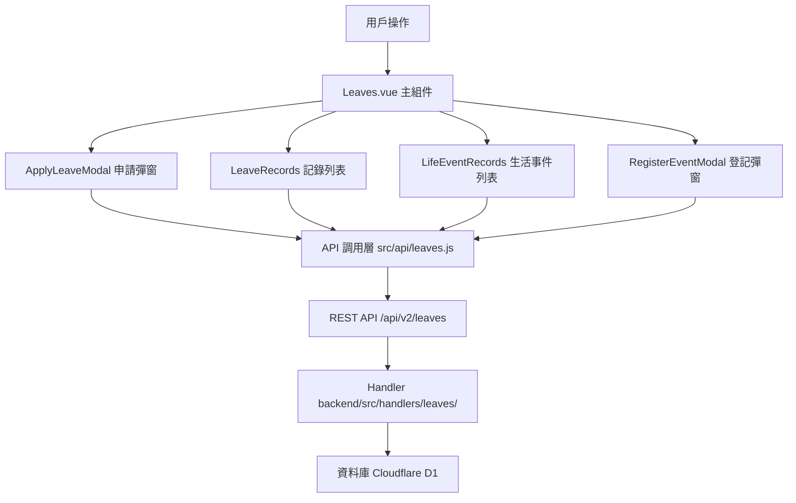

# Design Document: BR7: 假期管理（Leaves）

## Overview

假期管理功能提供員工假期申請、餘額管理、生活事件登記等功能。

本功能是人力資源管理系統的核心模組之一，提供統一的假期申請、餘額查看和管理界面，幫助員工管理各類假別與餘額，支持申請、餘額扣減、併入薪資扣款與工時規則。

## Steering Document Alignment

### Technical Standards (tech.md)

遵循以下技術標準：
- 使用 Vue 3 Composition API 開發前端組件
- 使用 Ant Design Vue 作為 UI 組件庫
- 使用 RESTful API 進行前後端通信
- 使用 Cloudflare Workers 作為後端運行環境
- 使用 Cloudflare D1 (SQLite) 作為資料庫
- 遵循統一的錯誤處理和回應格式
- 使用參數化查詢防止 SQL 注入
- 實現餘額扣減和歸還的原子性操作

### Project Structure (structure.md)

遵循以下項目結構：
- 前端組件位於 `src/components/leaves/` 或 `src/views/Leaves.vue`
- API 調用層位於 `src/api/leaves.js`
- 後端 Handler 位於 `backend/src/handlers/leaves/`
- 資料庫 Migration 位於 `backend/migrations/`
- 遵循命名規範：組件使用 PascalCase，Handler 使用 kebab-case

## Code Reuse Analysis

### Existing Components to Leverage

- **Leaves.vue**: 假期管理主頁面（已有，需增強）
- **ApplyLeaveModal.vue**: 申請假期彈窗（已有，需增強）
- **LeaveRecords.vue**: 假期記錄列表組件（已有，需增強）
- **LifeEventRecords.vue**: 生活事件記錄列表組件（已有，需增強）
- **RegisterEventModal.vue**: 登記生活事件彈窗（已有，需增強）

### Integration Points

- **handleCreateLeave**: 處理假期申請 API 請求，位於 `backend/src/handlers/leaves/leave-crud.js`
  - API 路由: `POST /api/v2/leaves`
  - 需要實現餘額檢查和扣減邏輯
- **handleGetLeaveBalances**: 處理假期餘額查詢，位於 `backend/src/handlers/leaves/leave-balances.js`
  - API 路由: `GET /api/v2/leaves/balances`
- **handleGetLeaves**: 處理假期記錄查詢，位於 `backend/src/handlers/leaves/leave-crud.js`
  - API 路由: `GET /api/v2/leaves`
- **handleGetLifeEvents**: 處理生活事件記錄查詢，位於 `backend/src/handlers/leaves/leave-life-events.js`
  - API 路由: `GET /api/v2/leaves/life-events`
- **handleCreateLifeEvent**: 處理生活事件登記，位於 `backend/src/handlers/leaves/leave-life-events.js`
  - API 路由: `POST /api/v2/leaves/life-events`
- **handleDeleteLifeEvent**: 處理生活事件刪除，位於 `backend/src/handlers/leaves/leave-life-events.js`
  - API 路由: `DELETE /api/v2/leaves/life-events/:id`
- **handleUpdateLeave**: 處理假期編輯，位於 `backend/src/handlers/leaves/leave-crud.js`
  - API 路由: `PUT /api/v2/leaves/:id`
- **handleDeleteLeave**: 處理假期刪除，位於 `backend/src/handlers/leaves/leave-crud.js`
  - API 路由: `DELETE /api/v2/leaves/:id`
- **handleExpireCompensatoryLeaves**: 處理補休到期轉換，位於 `backend/src/handlers/leaves/leave-recalculate.js`
  - API 路由: `POST /api/v2/leaves/expire-compensatory`（可選：定時任務觸發）
  - 或通過 Cloudflare Cron Triggers 定時執行
- **LeaveRequests 表**: 存儲假期申請記錄
- **LeaveBalances 表**: 存儲假期餘額（特休、病假、事假）
- **CompensatoryLeaveGrants 表**: 存儲補休授予記錄（FIFO 管理）
- **LifeEventLeaveGrants 表**: 存儲生活事件假期授予記錄

## Architecture

### Component Architecture

前端採用 Vue 3 Composition API，組件結構清晰，職責單一：



### Modular Design Principles

- **Single File Responsibility**: 每個組件文件只處理一個功能模組
- **Component Isolation**: 組件之間通過 props 和 events 通信，保持獨立
- **Service Layer Separation**: API 調用與業務邏輯分離，使用統一的 API 工具函數
- **Utility Modularity**: 工具函數按功能分組，可在多處重用

## Components and Interfaces

### Leaves.vue

- **Purpose**: 假期管理主頁面，整合所有子組件
- **Location**: `src/views/Leaves.vue`
- **Interfaces**: 無（頁面組件，無對外接口）
- **Props**: 無
- **Events**: 無
- **Dependencies**: 
  - Ant Design Vue 組件庫
  - Vue Router
  - Pinia Store (假期狀態管理)
- **Reuses**: 
  - ApplyLeaveModal, LeaveRecords, LifeEventRecords, RegisterEventModal 子組件
  - API 調用工具函數 (`@/api/leaves`)
  - 日期格式化工具 (`@/utils/formatters`)
- **Features**:
  - 顯示假期餘額總覽
  - 處理假期申請、編輯、刪除
  - 處理生活事件登記、刪除
  - 篩選和查詢假期記錄

### ApplyLeaveModal.vue

- **Purpose**: 申請假期彈窗組件
- **Location**: `src/components/leaves/ApplyLeaveModal.vue`
- **Interfaces**: 
  - Props: `visible`, `editingLeave`, `gender`, `balances`
  - Events: `update:visible`, `submit`, `cancel`
- **Dependencies**: 
  - Ant Design Vue Modal, Form, Select, DatePicker 組件
  - 假別過濾工具 (`@/utils/leaveTypeFilter`)
  - 時數計算工具 (`@/utils/leaveCalculator`)
- **Reuses**: 
  - 假別選項生成邏輯
  - 時數自動計算邏輯
  - 餘額檢查邏輯
- **Features**:
  - 假別選擇（根據性別和生活事件自動過濾）
  - 日期和時間選擇
  - 自動計算請假時數（扣除午休時間 12:00-13:00，如果請假時間跨越午休則扣除 1 小時）
  - 餘額檢查和警告顯示
  - 表單驗證
  - 提交處理

### LeaveRecords.vue

- **Purpose**: 假期記錄列表組件
- **Location**: `src/components/leaves/LeaveRecords.vue`
- **Interfaces**: 
  - Props: `leaves`, `loading`, `showUserName`
  - Events: `edit`, `delete`
- **Dependencies**: 
  - Ant Design Vue Table 組件
  - 假別翻譯 (`@/constants/leaveTypes`)
- **Reuses**: 
  - 日期格式化工具
  - 假別翻譯映射
- **Features**:
  - 顯示假期記錄列表
  - 支援編輯和刪除操作
  - 管理員可查看所有員工的記錄

### LifeEventRecords.vue

- **Purpose**: 生活事件記錄列表組件
- **Location**: `src/components/leaves/LifeEventRecords.vue`
- **Interfaces**: 
  - Props: `lifeEvents`, `loading`
  - Events: `delete`
- **Dependencies**: 
  - Ant Design Vue Table 組件
  - 生活事件類型翻譯
- **Reuses**: 
  - 日期格式化工具
  - 生活事件類型映射
- **Features**:
  - 顯示生活事件記錄列表
  - 支援刪除操作

### RegisterEventModal.vue

- **Purpose**: 登記生活事件彈窗組件
- **Location**: `src/components/leaves/RegisterEventModal.vue`
- **Interfaces**: 
  - Props: `visible`
  - Events: `update:visible`, `submit`, `cancel`
- **Dependencies**: 
  - Ant Design Vue Modal, Form, Select, DatePicker 組件
  - 生活事件類型選項
- **Reuses**: 
  - 日期格式化工具
  - 生活事件類型映射
- **Features**:
  - 生活事件類型選擇
  - 事件日期選擇
  - 表單驗證
  - 提交處理

## Data Models

### LeaveRequest

```
- leave_id: INTEGER (主鍵)
- user_id: INTEGER (外鍵 -> Users)
- leave_type: TEXT (假別類型)
- start_date: TEXT (開始日期 YYYY-MM-DD)
- end_date: TEXT (結束日期 YYYY-MM-DD)
- unit: TEXT (單位: 'hours' 或 'days')
- amount: REAL (時數或天數)
- start_time: TEXT (開始時間 HH:mm)
- end_time: TEXT (結束時間 HH:mm)
- status: TEXT (狀態: 'approved')
- notes: TEXT (備註)
- submitted_at: TEXT (提交時間)
- is_deleted: INTEGER (軟刪除標記)
- created_at: TEXT (創建時間)
- updated_at: TEXT (更新時間)
```

### LeaveBalance

```
- balance_id: INTEGER (主鍵)
- user_id: INTEGER (外鍵 -> Users)
- leave_type: TEXT (假別類型)
- year: INTEGER (年份)
- total: REAL (總額)
- used: REAL (已使用)
- remain: REAL (剩餘)
- created_at: TEXT (創建時間)
- updated_at: TEXT (更新時間)
```

### CompensatoryLeaveGrant

```
- grant_id: INTEGER (主鍵)
- user_id: INTEGER (外鍵 -> Users)
- source_timelog_id: INTEGER (來源工時記錄 ID)
- hours_generated: REAL (產生的補休時數)
- hours_used: REAL (已使用時數)
- hours_remaining: REAL (剩餘時數)
- generated_date: TEXT (產生日期 YYYY-MM-DD)
- expiry_date: TEXT (到期日 YYYY-MM-DD)
- original_rate: REAL (原始費率)
- status: TEXT (狀態: 'active', 'expired', 'fully_used')
- created_at: TEXT (創建時間)
- updated_at: TEXT (更新時間)
```

### LifeEventLeaveGrant

```
- grant_id: INTEGER (主鍵)
- user_id: INTEGER (外鍵 -> Users)
- event_type: TEXT (事件類型)
- event_date: TEXT (事件日期 YYYY-MM-DD)
- leave_type: TEXT (對應假別)
- days_granted: INTEGER (給予天數)
- days_used: INTEGER (已使用天數)
- days_remaining: INTEGER (剩餘天數)
- valid_from: TEXT (有效開始日期)
- valid_until: TEXT (有效結束日期)
- status: TEXT (狀態: 'active', 'deleted')
- notes: TEXT (備註)
- created_by: INTEGER (創建者)
- created_at: TEXT (創建時間)
- updated_at: TEXT (更新時間)
```

## Error Handling

### Error Scenarios

1. **餘額不足**:
   - **Handling**: 阻止提交，顯示錯誤訊息
   - **User Impact**: 用戶看到「餘額不足」錯誤提示

2. **假別不可用**:
   - **Handling**: 假別選單中不顯示該選項
   - **User Impact**: 用戶看不到不可用的假別選項

3. **編輯時餘額不足**:
   - **Handling**: 阻止修改，顯示錯誤訊息
   - **User Impact**: 用戶看到「新額度超過可用餘額」錯誤提示

4. **資料庫操作失敗**:
   - **Handling**: 回滾事務，顯示錯誤訊息
   - **User Impact**: 用戶看到「操作失敗，請重試」錯誤提示

5. **補休 FIFO 扣減失敗**:
   - **Handling**: 回滾所有扣減操作，顯示錯誤訊息
   - **User Impact**: 用戶看到「補休扣減失敗，請重試」錯誤提示

6. **生活事件假期餘額不足**:
   - **Handling**: 阻止提交，顯示錯誤訊息
   - **User Impact**: 用戶看到「生活事件假期餘額不足」錯誤提示

7. **編輯時新額度超過可用餘額**:
   - **Handling**: 阻止修改，顯示錯誤訊息
   - **User Impact**: 用戶看到「新額度超過可用餘額」錯誤提示

## Testing Strategy

### Unit Testing

- **餘額計算邏輯測試**: 測試特休、病假、事假餘額計算邏輯
- **補休 FIFO 扣減邏輯測試**: 測試補休按產生日期排序和扣減邏輯
- **假別選單過濾邏輯測試**: 測試根據性別和生活事件餘額過濾假別選項
- **時數計算邏輯測試**: 測試請假時數計算（包含午休時間 12:00-13:00 扣除）
- **補休狀態更新測試**: 測試補休部分使用和完全使用的狀態更新（hours_remaining, hours_used, status）
- **生活事件假期餘額計算測試**: 測試生活事件假期餘額計算和過濾邏輯

### Integration Testing

- **假期申請流程測試**: 測試完整的假期申請流程（包含餘額檢查、扣減、記錄創建）
- **編輯和刪除流程測試**: 測試編輯和刪除流程（包含餘額歸還和重新扣減）
- **生活事件登記流程測試**: 測試生活事件登記流程（包含假期額度自動給予）
- **補休 FIFO 扣減和歸還流程測試**: 測試補休 FIFO 扣減和歸還流程的完整性
- **颱風假處理測試**: 測試颱風假特殊處理（無餘額檢查、無餘額扣減）
- **薪資整合測試**: 測試假期記錄與薪資系統的整合

### End-to-End Testing

- **完整假期申請流程測試**: 測試用戶從選擇假別到提交申請的完整流程（包含時數計算和午休時間 12:00-13:00 扣除）
- **假期記錄查詢和篩選測試**: 測試假期記錄查詢功能（依期間、人員、假別篩選）
- **生活事件管理測試**: 測試生活事件登記、查看和刪除的完整流程
- **管理員功能測試**: 測試管理員查看所有員工假期記錄的功能
- **補休 FIFO 管理測試**: 測試補休 FIFO 扣減和歸還的完整流程
- **補休到期轉換測試**: 測試補休到期自動轉換為加班費的功能（可選：模擬測試）
- **假別選單過濾測試**: 測試假別選單根據性別和生活事件餘額的動態過濾

