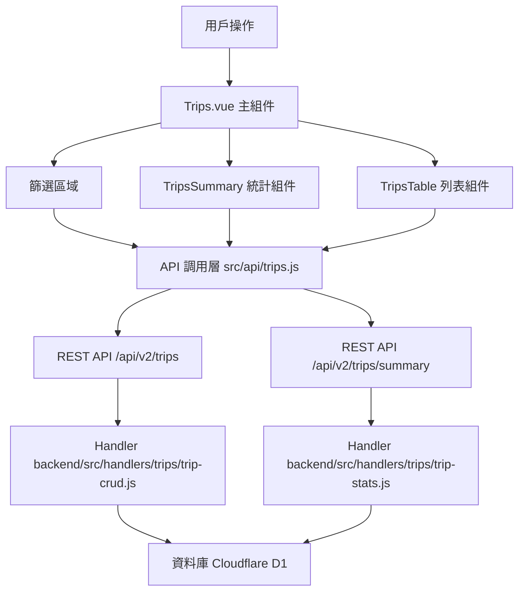

# Design Document: BR8.1: 外出記錄列表

## Overview

外出記錄列表展示、查詢、篩選和統計功能

本功能是外出記錄管理系統的核心模組之一，提供統一的外出記錄查看、查詢、篩選界面，幫助員工快速找到目標外出記錄、查看統計摘要，並追蹤交通補貼。

## Steering Document Alignment

### Technical Standards (tech.md)

遵循以下技術標準：
- 使用 Vue 3 Composition API 開發前端組件
- 使用 Ant Design Vue 作為 UI 組件庫
- 使用 RESTful API 進行前後端通信
- 使用 Cloudflare Workers 作為後端運行環境
- 使用 Cloudflare D1 (SQLite) 作為資料庫
- 遵循統一的錯誤處理和回應格式
- 使用參數化查詢防止 SQL 注入
- 實現外出記錄篩選和統計機制

### Project Structure (structure.md)

遵循以下項目結構：
- 前端組件位於 `src/components/trips/` 或 `src/views/Trips.vue`
- API 調用層位於 `src/api/trips.js`
- 後端 Handler 位於 `backend/src/handlers/trips/`
- 資料庫 Migration 位於 `backend/migrations/`
- 遵循命名規範：組件使用 PascalCase，Handler 使用 kebab-case

## Code Reuse Analysis

### Existing Components to Leverage

- **TripsTable.vue**: 用於外出記錄列表展示（已有，需增強）
- **TripsSummary.vue**: 用於統計摘要顯示（已有，需增強）
- **TripFormModal.vue**: 用於新增/編輯外出記錄（已有，在 br8-2 中使用）

### Integration Points

- **handleGetTrips**: 處理外出記錄列表 API 請求，位於 `backend/src/handlers/trips/trip-crud.js`
  - API 路由: `GET /api/v2/trips`（支援查詢參數篩選）
- **handleGetTripSummary**: 處理統計摘要 API 請求，位於 `backend/src/handlers/trips/trip-stats.js`
  - API 路由: `GET /api/v2/trips/summary`（支援查詢參數篩選）
- **handleDeleteTrip**: 處理外出記錄刪除 API 請求，位於 `backend/src/handlers/trips/trip-crud.js`
  - API 路由: `DELETE /api/v2/trips/:id`（支援權限控制和軟刪除）
- **BusinessTrips 表**: 存儲外出記錄基本資訊
- **Clients 表**: 存儲客戶資訊
- **Users 表**: 存儲員工資訊

## Architecture

### Component Architecture

前端採用 Vue 3 Composition API，組件結構清晰，職責單一：



### Modular Design Principles

- **Single File Responsibility**: 每個組件文件只處理一個功能模組
- **Component Isolation**: 組件之間通過 props 和 events 通信，保持獨立
- **Service Layer Separation**: API 調用與業務邏輯分離，使用統一的 API 工具函數
- **Utility Modularity**: 工具函數按功能分組，可在多處重用

## Components and Interfaces

### Trips (主組件)

- **Purpose**: 外出記錄列表頁面的主組件，整合所有子組件
- **Location**: `src/views/Trips.vue`
- **Interfaces**: 無（頁面組件，無對外接口）
- **Props**: 無
- **Events**: 無
- **Dependencies**: 
  - Ant Design Vue 組件庫
  - Vue Router
  - Pinia Store (外出記錄狀態管理)
- **Reuses**: 
  - TripsSummary, TripsTable, TripFormModal 子組件
  - API 調用工具函數 (`@/utils/apiHelpers`)
  - 日期格式化工具 (`@/utils/formatters`)
- **Features**:
  - 處理篩選條件變更（月份、員工、客戶）
  - 處理外出記錄新增、編輯、刪除
  - 在組件掛載時獲取用戶列表、客戶列表等前置數據
  - 管理分頁狀態
  - 管理表單彈窗狀態（新增/編輯模式）

### TripsSummary

- **Purpose**: 統計摘要組件
- **Location**: `src/components/trips/TripsSummary.vue`
- **Interfaces**: Props (summary)，無 Events
- **Props**: 
  - `summary` (Object, required): 統計摘要數據
    - `trip_count` (Number): 外出次數
    - `total_distance_km` (Number): 總距離（公里）
    - `total_subsidy_twd` (Number): 交通補貼總額（新台幣）
- **Events**: 無
- **Dependencies**: Ant Design Vue 組件庫
- **Reuses**: 無

### TripsTable

- **Purpose**: 外出記錄列表展示組件
- **Location**: `src/components/trips/TripsTable.vue`
- **Interfaces**: Props (trips, loading, currentUser, pagination) 和 Events (@edit, @delete, @page-change)
- **Props**: 
  - `trips` (Array, required): 外出記錄列表
  - `loading` (Boolean, optional): 加載狀態
  - `currentUser` (Object, required): 當前登入用戶
  - `pagination` (Object, required): 分頁資訊
    - `current` (Number): 當前頁碼
    - `pageSize` (Number): 每頁顯示筆數
    - `total` (Number): 總筆數
- **Events**:
  - `@edit`: 編輯外出記錄
  - `@delete`: 刪除外出記錄
  - `@page-change`: 頁碼或每頁顯示筆數變更
- **Dependencies**: Ant Design Vue 組件庫
- **Reuses**: 
  - 日期格式化工具
  - 金額格式化工具
  - 狀態標籤組件（顯示 pending/approved/rejected 狀態）

## Data Models

### Trip (外出記錄)

```
- trip_id: Number (外出記錄 ID)
- user_id: Number (員工 ID)
- user_name: String (員工名稱，從 Users 表 JOIN)
- client_id: Number (客戶 ID，可為 null)
- client_name: String (客戶名稱，從 Clients 表 JOIN，可為 null)
- trip_date: String (外出日期，格式：YYYY-MM-DD)
- destination: String (目的地)
- distance_km: Number (距離，公里)
- purpose: String (外出目的，可為 null)
- transport_subsidy_twd: Number (交通補貼，新台幣)
- status: String (狀態：'pending'|'approved'|'rejected')
- notes: String (備註，可為 null)
- submitted_at: String (提交時間)
- reviewed_at: String (審核時間，可為 null)
- reviewed_by: Number (審核人 ID，可為 null)
- reviewer_name: String (審核人名稱，從 Users 表 JOIN，可為 null)
- created_at: String (建立時間)
- updated_at: String (更新時間)
```

### TripSummary (統計摘要)

```
- trip_count: Number (外出次數)
- total_distance_km: Number (總距離，公里)
- total_subsidy_twd: Number (交通補貼總額，新台幣)
```

### TripFilters (篩選條件)

```
- month: String (月份，格式：YYYY-MM)
- user_id: Number (員工 ID，可為 null，僅管理員可見)
- client_id: Number (客戶 ID，可為 null)
- page: Number (當前頁碼，預設 1)
- per_page: Number (每頁顯示筆數，預設 20，最多 100)
```

## Error Handling

### Error Scenarios

1. **API 請求失敗**:
   - **Handling**: 顯示錯誤訊息，使用 Ant Design Vue 的 `message.error()`
   - **User Impact**: 用戶看到錯誤提示，可以重試

2. **篩選條件無結果**:
   - **Handling**: 顯示「無數據」提示，使用 Ant Design Vue 的 `Table` 組件的 `empty` 插槽
   - **User Impact**: 用戶看到「無數據」提示，可以調整篩選條件

3. **權限不足**:
   - **Handling**: 後端驗證權限，返回 403 錯誤
   - **User Impact**: 用戶看到權限錯誤提示

4. **分頁參數錯誤**:
   - **Handling**: 前端驗證分頁參數，後端也驗證
   - **User Impact**: 分頁功能正常運作

## Testing Strategy

### Unit Testing

- 測試 TripsSummary 組件的統計顯示邏輯
- 測試 TripsTable 組件的顯示邏輯
- 測試權限判斷邏輯（canEdit 函數）

### Integration Testing

- 測試 API 調用和數據流轉
- 測試篩選條件變更和列表更新
- 測試統計摘要更新
- 測試分頁功能

### End-to-End Testing

- 測試完整的外出記錄列表查看流程
- 測試篩選功能（月份、員工、客戶）
- 測試統計摘要顯示
- 測試分頁功能
- 測試刪除功能

