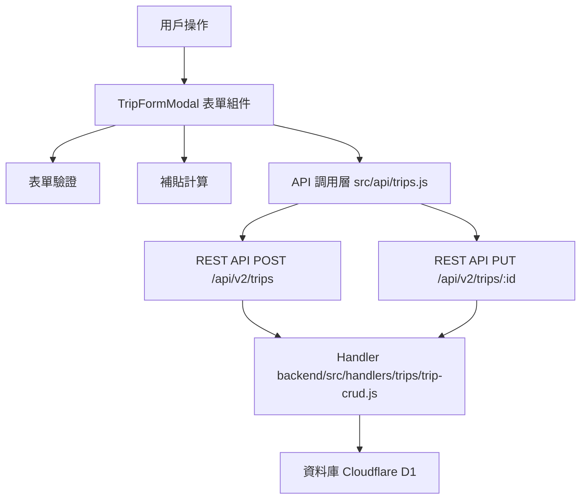

# Design Document: BR8.2: 外出記錄建立

## Overview

外出記錄建立功能提供新增和編輯外出記錄的界面。本功能幫助員工快速建立外出記錄，自動計算交通補貼，並與任務和客戶關聯。

## Steering Document Alignment

### Technical Standards (tech.md)

遵循以下技術標準：
- 使用 Vue 3 Composition API 開發前端組件
- 使用 Ant Design Vue 作為 UI 組件庫
- 使用 RESTful API 進行前後端通信
- 使用 Cloudflare Workers 作為後端運行環境
- 使用 Cloudflare D1 (SQLite) 作為資料庫
- 遵循統一的錯誤處理和回應格式
- 使用參數化查詢防止 SQL 注入

### Project Structure (structure.md)

遵循以下項目結構：
- 前端組件位於 `src/components/trips/`
- API 調用層位於 `src/api/trips.js`
- 後端 Handler 位於 `backend/src/handlers/trips/`
- 資料庫 Migration 位於 `backend/migrations/`
- 遵循命名規範：組件使用 PascalCase，Handler 使用 kebab-case

## Code Reuse Analysis

### Existing Components to Leverage

- **TripFormModal.vue**: 用於外出記錄表單（已有，需增強）
- **subsidyCalculator.js**: 用於補貼計算（已有）

### Integration Points

- **handleCreateTrip**: 處理新增外出記錄 API 請求，位於 `backend/src/handlers/trips/trip-crud.js`
  - API 路由: `POST /api/v2/trips`
- **handleUpdateTrip**: 處理更新外出記錄 API 請求，位於 `backend/src/handlers/trips/trip-crud.js`
  - API 路由: `PUT /api/v2/trips/:id`
- **BusinessTrips 表**: 存儲外出記錄基本資訊
- **Clients 表**: 存儲客戶資訊
- **Users 表**: 存儲員工資訊
- **Tasks 表**: 存儲任務資訊

## Architecture

### Component Architecture

前端採用 Vue 3 Composition API，組件結構清晰，職責單一：



## Components and Interfaces

### TripFormModal

- **Purpose**: 外出記錄表單組件
- **Location**: `src/components/trips/TripFormModal.vue`
- **Interfaces**: Props (visible, editingTrip, clients, tasks, users, isAdmin) 和 Events (@submit, @cancel)
- **Props**: 
  - `visible` (Boolean, required): 是否顯示表單
  - `editingTrip` (Object, optional): 編輯中的外出記錄（新增時為 null）
  - `clients` (Array, required): 客戶列表
  - `tasks` (Array, optional): 任務列表
  - `users` (Array, optional): 員工列表（管理員可見）
  - `isAdmin` (Boolean, required): 是否為管理員
- **Events**:
  - `@submit`: 表單提交（傳遞表單數據和是否為編輯模式）
  - `@cancel`: 取消表單
- **Dependencies**: Ant Design Vue 組件庫
- **Reuses**: 
  - 補貼計算工具 (`@/utils/subsidyCalculator`)
  - 日期格式化工具 (`@/utils/formatters`)

## Data Models

### TripFormData (表單數據)

```
- user_id: Number (員工 ID，管理員可選，一般員工自動使用當前用戶)
- trip_date: String (外出日期，格式：YYYY-MM-DD)
- start_time: String (開始時間，格式：HH:mm)
- end_time: String (結束時間，格式：HH:mm)
- destination: String (目的地)
- distance_km: Number (距離，公里)
- client_id: Number (客戶 ID，可選)
- task_id: Number (任務 ID，可選)
- purpose: String (外出目的，可選)
- notes: String (備註，可選)
```

## Error Handling

### Error Scenarios

1. **表單驗證失敗**:
   - **Handling**: 顯示驗證錯誤訊息，使用 Ant Design Vue 的 Form 組件驗證
   - **User Impact**: 用戶看到驗證錯誤提示，可以修正
   - **驗證項目**: 必填欄位、時間邏輯（結束時間必須晚於開始時間）、距離必須 > 0、客戶和任務是否存在

2. **API 請求失敗**:
   - **Handling**: 顯示錯誤訊息，使用 Ant Design Vue 的 `message.error()`
   - **User Impact**: 用戶看到錯誤提示，可以重試

3. **權限不足**:
   - **Handling**: 後端驗證權限，返回 403 錯誤
   - **User Impact**: 用戶看到權限錯誤提示

## Testing Strategy

### Unit Testing

- 測試表單驗證邏輯（必填欄位、時間邏輯、距離驗證）
- 測試補貼計算邏輯（邊界情況、向上取整）
- 測試權限判斷邏輯（一般員工 vs 管理員）

### Integration Testing

- 測試 API 調用和數據流轉（新增、更新）
- 測試表單提交和數據保存（驗證數據正確存入資料庫）
- 測試補貼計算和數據更新（距離修改時補貼重新計算）
- 測試外鍵驗證（客戶、任務存在性驗證）
- 測試薪資重新計算觸發

### End-to-End Testing

- 測試完整的新增外出記錄流程（包含所有必填欄位和可選欄位）
- 測試完整的編輯外出記錄流程（包含權限驗證）
- 測試管理員替其他員工新增流程
- 測試表單驗證（時間驗證、客戶驗證、任務驗證）
- 測試補貼計算（即時預覽和資料庫存儲）

