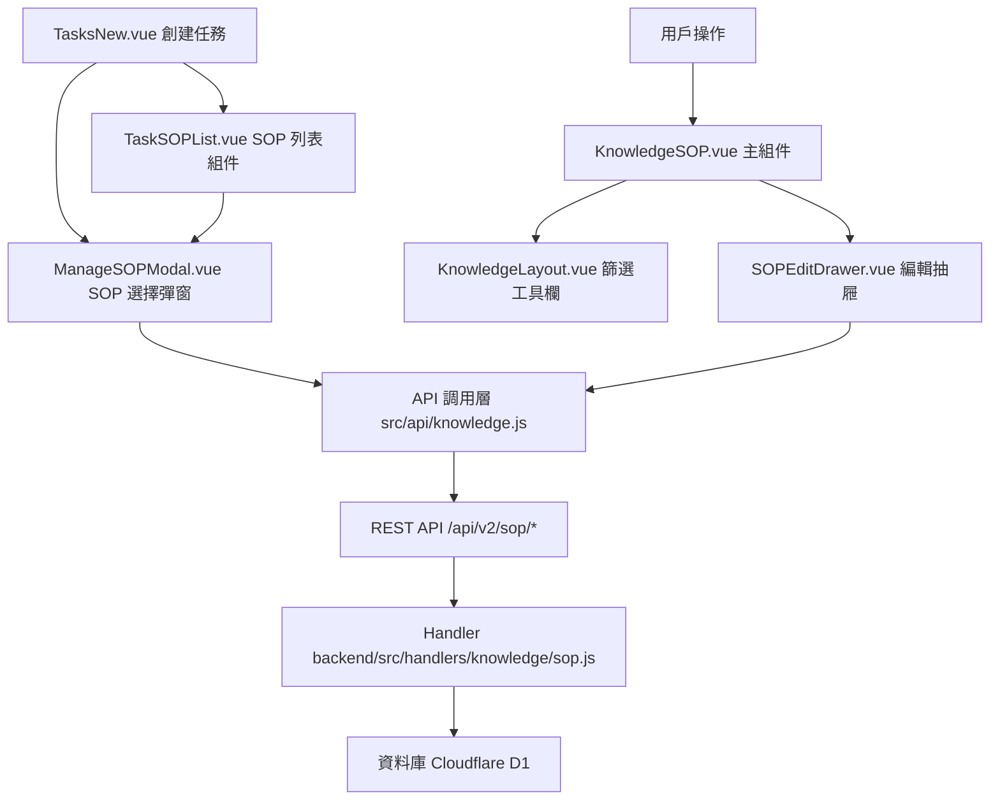

# Design Document: BR9: SOP 管理

## Overview

SOP（Standard Operating Procedures）管理功能，提供 SOP 的建立、編輯、刪除、搜尋、篩選和自動套用功能。

本功能是知識庫系統的核心模組之一，與任務管理系統緊密整合，支援服務層級和任務層級 SOP，並在創建任務時自動套用相關 SOP。

## Steering Document Alignment

### Technical Standards (tech.md)

遵循以下技術標準：
- 使用 Vue 3 Composition API 開發前端組件
- 使用 Ant Design Vue 作為 UI 組件庫
- 使用 RESTful API 進行前後端通信
- 使用 Cloudflare Workers 作為後端運行環境
- 使用 Cloudflare D1 (SQLite) 作為資料庫
- 遵循統一的錯誤處理和回應格式
- 使用參數化查詢防止 SQL 注入

### Project Structure (structure.md)

遵循以下項目結構：
- 前端組件位於 `src/components/knowledge/` 或 `src/views/knowledge/`
- API 調用層位於 `src/api/knowledge.js`
- 後端 Handler 位於 `backend/src/handlers/knowledge/sop.js`
- 資料庫 Migration 位於 `backend/migrations/`
- 遵循命名規範：組件使用 PascalCase，Handler 使用 kebab-case

## Code Reuse Analysis

### Existing Components to Leverage

- **KnowledgeSOP.vue**: 用於 SOP 列表和詳情展示（已有，需增強）
- **SOPEditDrawer.vue**: 用於編輯 SOP 抽屜組件（已有，需增強）
- **ManageSOPModal.vue**: 用於任務中選擇 SOP 的彈窗（已有，需修改過濾邏輯）
- **TaskSOPList.vue**: 用於任務中顯示 SOP 列表（已有，需新增 clientId prop）
- **TasksNew.vue**: 用於創建任務頁面（已有，需新增自動勾選邏輯）

### Integration Points

- **handleGetSOPList**: 處理 SOP 列表 API 請求，位於 `backend/src/handlers/knowledge/sop.js`
  - API 路由: `GET /api/v2/sop`
- **handleGetSOPDetail**: 處理 SOP 詳情 API 請求，位於 `backend/src/handlers/knowledge/sop.js`
  - API 路由: `GET /api/v2/sop/:id`
- **handleCreateSOP**: 處理 SOP 建立 API 請求，位於 `backend/src/handlers/knowledge/sop.js`
  - API 路由: `POST /api/v2/sop`
- **handleUpdateSOP**: 處理 SOP 更新 API 請求，位於 `backend/src/handlers/knowledge/sop.js`
  - API 路由: `PUT /api/v2/sop/:id`
- **handleDeleteSOP**: 處理 SOP 刪除 API 請求，位於 `backend/src/handlers/knowledge/sop.js`
  - API 路由: `DELETE /api/v2/sop/:id`
- **SOPDocuments 表**: 存儲 SOP 基本資訊
- **ActiveTaskSOPs 表**: 存儲任務與 SOP 的關聯關係

## Architecture

### Component Architecture

前端採用 Vue 3 Composition API，組件結構清晰，職責單一：



### Modular Design Principles

- **Single File Responsibility**: 每個組件文件只處理一個功能模組
- **Component Isolation**: 組件之間通過 props 和 events 通信，保持獨立
- **Service Layer Separation**: API 調用與業務邏輯分離，使用統一的 API 工具函數
- **Utility Modularity**: 工具函數按功能分組，可在多處重用

## Components and Interfaces

### KnowledgeSOP

- **Purpose**: SOP 列表和詳情展示的主組件
- **Location**: `src/views/knowledge/KnowledgeSOP.vue`
- **Props**: 無（使用路由參數）
- **Events**: 無
- **Dependencies**: 
  - Ant Design Vue 組件庫
  - Vue Router (用於路由導航)
  - Pinia Store (知識庫狀態管理)
- **Reuses**: 
  - SOPEditDrawer 編輯抽屜組件
  - KnowledgeLayout 篩選工具欄組件

### SOPEditDrawer

- **Purpose**: SOP 建立和編輯的抽屜組件
- **Location**: `src/components/knowledge/SOPEditDrawer.vue`
- **Props**: 
  - `visible`: Boolean - 抽屜顯示狀態
  - `sop`: Object - 要編輯的 SOP（null 表示新建）
- **Events**: 
  - `close`: 關閉抽屜
  - `success`: 保存成功
- **Dependencies**: 
  - RichTextEditor 富文本編輯器組件
  - Ant Design Vue 表單組件
- **Reuses**: 
  - API 調用工具函數 (`@/api/knowledge`)

### KnowledgeSOPDetail

- **Purpose**: SOP 詳情展示組件，支援直接編輯（參考 BR10 FAQ 詳情）
- **Location**: `src/views/knowledge/KnowledgeSOPDetail.vue` 或 `src/components/knowledge/SOPDetail.vue`
- **Props**: 
  - `sopId`: String/Number - SOP ID（從路由參數獲取）
- **Events**: 無
- **Dependencies**: 
  - SOPEditDrawer 編輯抽屜組件
  - Ant Design Vue 組件庫
- **Reuses**: 
  - API 調用工具函數 (`@/api/knowledge`)

### ManageSOPModal

- **Purpose**: 任務中選擇 SOP 的彈窗組件
- **Location**: `src/components/tasks/ManageSOPModal.vue`
- **Props**: 
  - `visible`: Boolean - 彈窗顯示狀態
  - `taskId`: String/Number - 任務 ID
  - `selectedSopIds`: Array - 已選中的 SOP ID 列表
  - `allSops`: Array - 所有可選的 SOP 列表
  - `clientId`: String/Number - 客戶 ID（新增，用於過濾）
- **Events**: 
  - `update:visible`: 更新顯示狀態
  - `success`: 保存成功
- **Dependencies**: 
  - Ant Design Vue 組件庫
- **Reuses**: 
  - API 調用工具函數 (`@/stores/tasks`)

### TasksNew

- **Purpose**: 創建任務頁面，包含自動勾選 SOP 邏輯
- **Location**: `src/views/tasks/TasksNew.vue`
- **Props**: 無
- **Events**: 無
- **Dependencies**: 
  - ManageSOPModal SOP 選擇彈窗
  - TaskSOPList SOP 列表組件
- **Reuses**: 
  - API 調用工具函數 (`@/api/knowledge`, `@/api/tasks`)

## Data Models

### SOPDocument

```
- sop_id: INTEGER (PRIMARY KEY)
- title: TEXT (NOT NULL)
- content: TEXT (NOT NULL)
- category: TEXT (服務類型，對應 service_code)
- tags: TEXT (JSON 陣列字串)
- version: INTEGER (DEFAULT 1)
- scope: TEXT ('service' 或 'task')
- client_id: TEXT (NULL 表示通用 SOP)
- is_published: BOOLEAN (DEFAULT 0，前端不使用)
- created_by: INTEGER (NOT NULL)
- created_at: TEXT (DEFAULT datetime('now'))
- updated_at: TEXT (DEFAULT datetime('now'))
- is_deleted: BOOLEAN (DEFAULT 0)
```

### ActiveTaskSOPs

```
- relation_id: INTEGER (PRIMARY KEY)
- task_id: INTEGER (NOT NULL)
- sop_id: INTEGER (NOT NULL)
- sort_order: INTEGER (DEFAULT 0)
- created_at: TEXT (DEFAULT datetime('now'))
```

## Error Handling

### Error Scenarios

1. **SOP 建立失敗**:
   - **Handling**: 顯示錯誤訊息，保持表單狀態
   - **User Impact**: 用戶看到錯誤提示，可以修正後重試

2. **SOP 更新失敗**:
   - **Handling**: 顯示錯誤訊息，保持編輯狀態
   - **User Impact**: 用戶看到錯誤提示，可以修正後重試

3. **SOP 刪除失敗**:
   - **Handling**: 顯示錯誤訊息
   - **User Impact**: 用戶看到錯誤提示，可以重試

4. **自動勾選 SOP 失敗**:
   - **Handling**: 記錄警告日誌，不影響任務創建流程
   - **User Impact**: 任務正常創建，但 SOP 需要手動選擇

5. **SOP 列表載入失敗**:
   - **Handling**: 顯示錯誤訊息，提供重試按鈕
   - **User Impact**: 用戶看到錯誤提示，可以點擊重試

## Testing Strategy

### Unit Testing

- 測試 SOP 過濾邏輯（客戶專屬、層級區分）
- 測試自動勾選邏輯（服務層級、任務層級）
- 測試版本號更新邏輯

### Integration Testing

- 測試 SOP CRUD 操作流程
- 測試任務創建時自動勾選 SOP 流程
- 測試 SOP 可見性過濾流程

### End-to-End Testing

- 測試完整 SOP 建立流程
- 測試任務創建時自動勾選 SOP 流程
- 測試 SOP 搜尋和篩選流程

