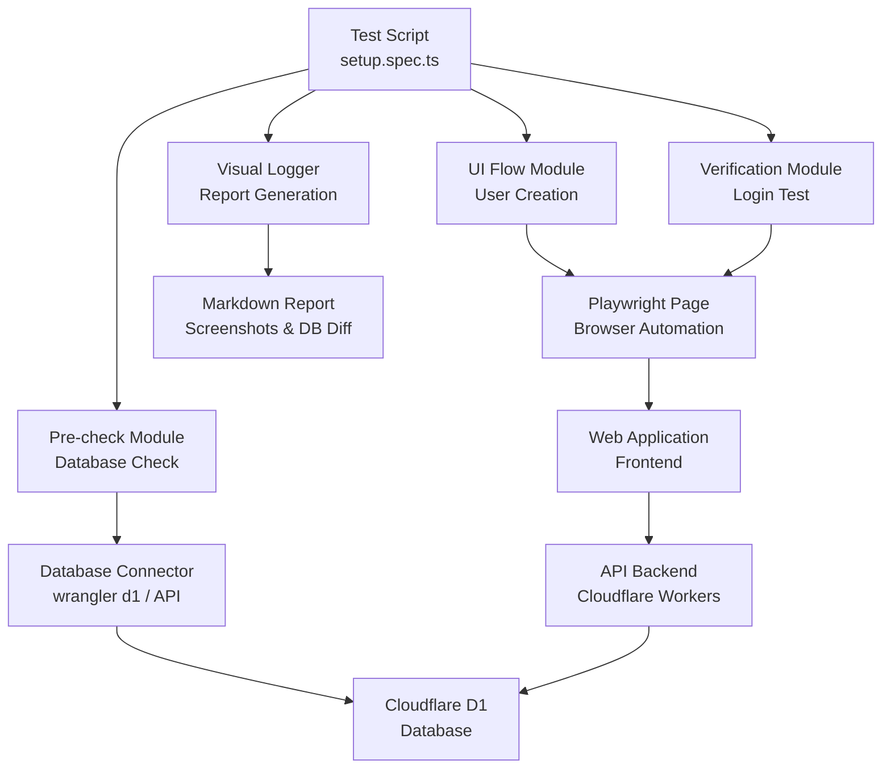

# QA-01: 認證與用戶基礎 - Design Document

## Overview

本設計文件規劃 QA-01 測試 Spec 的技術實作，目標是建立一個強健的 Playwright 自動化測試腳本，不僅執行測試，還充當「資料庫播種 (Seeder)」的角色。腳本必須具備冪等性（可重複執行而不報錯），並提供完整的視覺化日誌記錄。

**核心設計原則**：
- **冪等性優先**：腳本可重複執行，不會因為資料已存在而失敗
- **混合策略**：結合 UI 測試（驗證功能）和資料庫直接操作（確保環境乾淨）
- **視覺化日誌**：自動產生 Markdown 報告，包含截圖和資料庫狀態對比
- **可維護性**：清晰的檔案結構和模組化設計

## Steering Document Alignment

### Technical Standards (tech.md)

本設計遵循以下技術標準：
- **測試框架**：使用 Playwright (TypeScript) 進行 E2E 測試
- **環境變數管理**：使用 `dotenv` 讀取 `.env` 配置
- **資料庫連接**：使用 `wrangler d1` 命令或 API 查詢 Cloudflare D1 資料庫
- **模組化設計**：測試工具和日誌工具分離，便於重用

### Project Structure (structure.md)

本設計遵循專案結構規範：
- **測試檔案位置**：`tests/e2e/qa-01-auth/` 目錄
- **工具檔案位置**：`tests/utils/` 目錄（共用工具）
- **日誌輸出位置**：`test-results/qa-01-auth/` 目錄
- **命名規範**：使用 kebab-case 命名檔案，PascalCase 命名類別

## Code Reuse Analysis

### Existing Components to Leverage

- **`tests/e2e/utils/auth.ts`**：
  - 重用 `login()` 函數進行登入操作
  - 重用 `clearCacheAndLogout()` 函數確保乾淨狀態
  - 擴展以支援 Seed Admin 登入

- **`tests/e2e/utils/test-data.ts`**：
  - 重用 `callAPI()` 函數進行 API 調用
  - 重用 `createTestUser()` 函數建立測試用戶（如果存在）
  - 擴展以支援完整的用戶資料建立

- **`playwright.config.ts`**：
  - 重用現有的 Playwright 配置
  - 使用 `baseURL` 環境變數配置

### Integration Points

- **Cloudflare D1 資料庫**：
  - 使用 `wrangler d1 execute` 命令查詢資料庫（Pre-check）
  - 或使用 API `/api/v2/mcp/query-database` 查詢（如果可用）
  - 或使用 MCP 工具 `mcp_cloudflare-management_d1_execute_query` 查詢

- **認證 API**：
  - 使用 `/api/v2/auth/login` 進行登入
  - 使用 `/api/v2/auth/me` 驗證 Session
  - 使用 `/api/v2/auth/logout` 登出

- **用戶管理 API**：
  - 使用 `/api/v2/settings/users` (POST) 建立用戶
  - 使用 `/api/v2/settings/users` (GET) 查詢用戶列表
  - 使用 `/api/v2/user-profile/:userId` (GET) 查詢用戶詳情

## Architecture

### 整體架構



### 模組化設計原則

1. **單一職責**：
   - `setup.spec.ts`：主測試腳本，協調各模組
   - `visual-logger.ts`：視覺化日誌工具，獨立於測試邏輯
   - `db-connector.ts`：資料庫連接工具，封裝查詢邏輯

2. **可重用性**：
   - 日誌工具可在其他測試 Spec 中重用
   - 資料庫連接工具可在其他測試中重用

3. **可測試性**：
   - 各模組可獨立測試
   - 日誌工具可模擬測試

## Components and Interfaces

### Component 1: Test Script (`setup.spec.ts`)

**Purpose**: 主測試腳本，執行完整的測試流程（Pre-check → 條件執行 → 驗證）

**Interfaces**:
```typescript
// 主測試流程
test('QA-01: 建立測試用戶基礎設施', async ({ page }) => {
  // 1. Pre-check: 檢查用戶是否存在
  // 2. Conditional Execution: 建立或重置用戶
  // 3. Verification: 驗證登入和個人資料頁面
})
```

**Dependencies**:
- `VisualLogger`：產生視覺化日誌
- `DatabaseConnector`：查詢資料庫
- `tests/e2e/utils/auth.ts`：登入工具

**Reuses**:
- `login()` 函數（擴展以支援 Seed Admin）
- `callAPI()` 函數（建立用戶）

### Component 2: Visual Logger (`visual-logger.ts`)

**Purpose**: 產生視覺化 Markdown 報告，包含截圖和資料庫狀態對比

**Interfaces**:
```typescript
class VisualLogger {
  constructor(outputDir: string)
  
  // 記錄步驟
  logStep(step: string, description: string): Promise<void>
  
  // 截圖
  captureScreenshot(page: Page, name: string, description: string): Promise<void>
  
  // 記錄資料庫狀態
  logDatabaseState(before: User[], after: User[], operation: string): Promise<void>
  
  // 產生 Markdown 報告
  generateReport(): Promise<string>
  
  // 儲存報告
  saveReport(): Promise<string>
}
```

**Dependencies**:
- `@playwright/test`：Page 類型
- `fs/promises`：檔案系統操作
- `path`：路徑處理

**Reuses**:
- 無（獨立工具）

### Component 3: Database Connector (`db-connector.ts`)

**Purpose**: 封裝資料庫查詢邏輯，支援多種連接方式

**Interfaces**:
```typescript
class DatabaseConnector {
  // 查詢用戶
  async queryUsers(usernames: string[]): Promise<User[]>
  
  // 檢查用戶是否存在
  async userExists(username: string): Promise<boolean>
  
  // 重置用戶密碼（如果使用直接 DB 操作）
  async resetUserPassword(username: string, password: string): Promise<void>
  
  // 確保用戶狀態（is_deleted = 0）
  async ensureUserActive(username: string): Promise<void>
}
```

**Dependencies**:
- `child_process`：執行 wrangler 命令
- 或 `fetch`：使用 API 查詢
- 或 MCP 工具：使用 MCP 協議查詢

**Reuses**:
- 無（獨立工具）

### Component 4: User Creation Helper (`user-creation-helper.ts`)

**Purpose**: 封裝用戶建立的 UI 操作邏輯

**Interfaces**:
```typescript
class UserCreationHelper {
  constructor(page: Page, logger: VisualLogger)
  
  // 建立用戶（透過 UI）
  async createUserViaUI(userData: UserData): Promise<number | null>
  
  // 驗證用戶建立成功
  async verifyUserCreated(username: string): Promise<boolean>
}
```

**Dependencies**:
- `@playwright/test`：Page 類型
- `VisualLogger`：記錄操作

**Reuses**:
- `callAPI()` 函數（如果使用 API 建立）

## Data Models

### User Data Model

```typescript
interface UserData {
  username: string
  name: string
  email: string
  password: string
  isAdmin: boolean
  phone?: string | null
  address?: string | null
  emergency_contact_name?: string | null
  emergency_contact_phone?: string | null
  gender: 'M' | 'F'
  birth_date?: string | null
  start_date: string
}

interface User {
  user_id: number
  username: string
  name: string
  email: string
  is_admin: boolean
  is_deleted: boolean
  phone?: string | null
  address?: string | null
  emergency_contact_name?: string | null
  emergency_contact_phone?: string | null
  gender?: string | null
  birth_date?: string | null
  start_date?: string | null
}
```

### Test User Definitions

根據 QA-00 黃金數據命名規範，定義以下測試用戶：

```typescript
const TEST_USERS = {
  TEST_ADMIN_01: {
    username: 'TEST_ADMIN_01',
    name: '測試管理員01',
    email: 'test_admin_01@test.com',
    password: '111111',
    isAdmin: true,
    phone: '0912345678',
    address: '台北市信義區測試路123號',
    emergency_contact_name: '緊急聯絡人',
    emergency_contact_phone: '0987654321',
    gender: 'M' as const,
    birth_date: '1990-01-01',
    start_date: '2024-01-01'
  },
  TEST_USER_STD: {
    username: 'TEST_USER_STD',
    name: '測試員工（標準）',
    email: 'test_user_std@test.com',
    password: '111111',
    isAdmin: false,
    phone: '0912345678',
    address: '台北市信義區測試路123號',
    emergency_contact_name: '緊急聯絡人',
    emergency_contact_phone: '0987654321',
    gender: 'M' as const,
    birth_date: '1990-01-01',
    start_date: '2024-01-01'
  },
  TEST_USER_LEGACY: {
    username: 'TEST_USER_LEGACY',
    name: '測試員工（舊資料）',
    email: 'test_user_legacy@test.com',
    password: '111111',
    isAdmin: false,
    phone: null,  // NULL 欄位
    address: null,  // NULL 欄位
    emergency_contact_name: null,  // NULL 欄位
    emergency_contact_phone: null,  // NULL 欄位
    gender: 'M' as const,
    birth_date: null,  // NULL 欄位
    start_date: '2024-01-01'
  },
  TEST_USER_ASSIGNEE: {
    username: 'TEST_USER_ASSIGNEE',
    name: '測試負責人',
    email: 'test_user_assignee@test.com',
    password: '111111',
    isAdmin: false,
    phone: '0912345678',
    address: '台北市信義區測試路123號',
    emergency_contact_name: '緊急聯絡人',
    emergency_contact_phone: '0987654321',
    gender: 'M' as const,
    birth_date: '1990-01-01',
    start_date: '2024-01-01'
  }
}
```

## Error Handling

### Error Scenarios

1. **Scenario 1: Seed Admin 登入失敗**
   - **Handling**: 檢查 `.env` 檔案是否存在 `SEED_ADMIN_USER` 和 `SEED_ADMIN_PASS`
   - **User Impact**: 測試失敗，顯示明確錯誤訊息：「請設定 SEED_ADMIN_USER 和 SEED_ADMIN_PASS 環境變數」

2. **Scenario 2: 資料庫連接失敗**
   - **Handling**: 嘗試多種連接方式（wrangler d1 → API → MCP），如果都失敗則使用 UI 流程
   - **User Impact**: 記錄警告，繼續使用 UI 流程（不影響測試）

3. **Scenario 3: 用戶已存在但建立失敗**
   - **Handling**: 使用資料庫直接重置密碼和狀態，確保環境乾淨
   - **User Impact**: 測試繼續執行，記錄「用戶已存在，已重置」

4. **Scenario 4: UI 操作超時**
   - **Handling**: 增加重試機制，記錄詳細錯誤訊息
   - **User Impact**: 測試失敗，但產生完整的日誌報告

5. **Scenario 5: 個人資料頁面白畫面**
   - **Handling**: 截圖記錄，檢查 Console 錯誤，驗證 NULL 欄位處理
   - **User Impact**: 測試失敗，但提供詳細的錯誤分析

## Testing Strategy

### 測試腳本流程設計 (Idempotency is King)

#### 1. Pre-check Phase（資料庫檢查）

**目標**：檢查測試用戶是否已存在

**實作方式**：
```typescript
// 方案 1: 使用 wrangler d1 execute（推薦）
async function checkUserExists(username: string): Promise<boolean> {
  const { exec } = require('child_process')
  const { promisify } = require('util')
  const execAsync = promisify(exec)
  
  const query = `SELECT user_id, username, is_deleted FROM Users WHERE username = '${username}'`
  const command = `wrangler d1 execute horgoscpa-db-v2 --remote --command "${query}"`
  
  try {
    const { stdout } = await execAsync(command)
    const result = JSON.parse(stdout)
    const user = result[0]?.results?.[0]
    return user && user.is_deleted === 0
  } catch (error) {
    console.warn('資料庫查詢失敗，將使用 UI 流程:', error)
    return false
  }
}

// 方案 2: 使用 API（備選）
async function checkUserExistsViaAPI(page: Page, username: string): Promise<boolean> {
  const response = await callAPI(page, 'GET', '/settings/users')
  if (response.ok && response.data) {
    return response.data.some((u: any) => u.username === username && !u.isDeleted)
  }
  return false
}

// 方案 3: 使用 MCP 工具（如果可用）
async function checkUserExistsViaMCP(username: string): Promise<boolean> {
  // 使用 mcp_cloudflare-management_d1_execute_query
  const query = `SELECT user_id, username, is_deleted FROM Users WHERE username = '${username}'`
  // ... MCP 調用邏輯
}
```

**Pre-check 邏輯**：
```typescript
const testUsers = ['TEST_ADMIN_01', 'TEST_USER_STD', 'TEST_USER_LEGACY', 'TEST_USER_ASSIGNEE']
const existingUsers: Record<string, boolean> = {}

for (const username of testUsers) {
  existingUsers[username] = await checkUserExists(username)
  logger.logStep('Pre-check', `檢查用戶 ${username}: ${existingUsers[username] ? '已存在' : '不存在'}`)
}
```

#### 2. Conditional Execution Phase（條件執行）

**目標**：根據 Pre-check 結果，決定使用 UI 流程或資料庫直接操作

**實作邏輯**：
```typescript
for (const [username, userData] of Object.entries(TEST_USERS)) {
  const exists = existingUsers[username]
  
  if (!exists) {
    // 情況 1: 用戶不存在 → 使用 UI 流程建立（驗證 UI 功能）
    logger.logStep('建立用戶', `開始建立用戶 ${username}（UI 流程）`)
    
    // 記錄建立前的資料庫狀態
    const beforeState = await dbConnector.queryUsers([username])
    logger.logDatabaseState(beforeState, [], '建立前')
    
    // 執行 UI 流程
    const userId = await userCreationHelper.createUserViaUI(userData)
    
    if (userId) {
      // 記錄建立後的資料庫狀態
      const afterState = await dbConnector.queryUsers([username])
      logger.logDatabaseState(beforeState, afterState, '建立後')
      
      logger.logStep('建立成功', `用戶 ${username} 建立成功，ID: ${userId}`)
    } else {
      throw new Error(`建立用戶 ${username} 失敗`)
    }
  } else {
    // 情況 2: 用戶已存在 → 使用資料庫直接操作重置（確保環境乾淨）
    logger.logStep('重置用戶', `用戶 ${username} 已存在，重置密碼和狀態`)
    
    // 記錄重置前的資料庫狀態
    const beforeState = await dbConnector.queryUsers([username])
    
    // 重置密碼和狀態
    await dbConnector.resetUserPassword(username, '111111')
    await dbConnector.ensureUserActive(username)
    
    // 記錄重置後的資料庫狀態
    const afterState = await dbConnector.queryUsers([username])
    logger.logDatabaseState(beforeState, afterState, '重置後')
    
    logger.logStep('重置成功', `用戶 ${username} 重置成功`)
  }
}
```

#### 3. Verification Phase（驗證）

**目標**：驗證所有測試用戶都能正常登入，且個人資料頁面正確處理 NULL 欄位

**實作邏輯**：
```typescript
// 登出 Seed Admin
await page.getByRole('button', { name: /登出|退出/ }).click()
await page.waitForURL('**/login')

// 驗證每個測試用戶
for (const [username, userData] of Object.entries(TEST_USERS)) {
  // 登入測試
  logger.logStep('登入驗證', `測試用戶 ${username} 登入`)
  await login(page, { username, password: '111111' })
  
  // 驗證首頁顯示
  if (userData.isAdmin) {
    await expect(page).toHaveURL(/.*\/dashboard/)
    await expect(page.getByText('系統設定')).toBeVisible()
  } else {
    await expect(page).toHaveURL(/.*\/dashboard/)
    await expect(page.getByText('系統設定')).not.toBeVisible()
  }
  
  // 特別測試 TEST_USER_LEGACY 的個人資料頁面
  if (username === 'TEST_USER_LEGACY') {
    logger.logStep('Legacy 資料檢查', `檢查 ${username} 的個人資料頁面`)
    
    // 導航到個人資料頁面
    await page.goto('/profile')
    await page.waitForLoadState('networkidle')
    
    // 截圖（證明沒有白畫面）
    await logger.captureScreenshot(page, 'legacy-user-profile', 'Legacy 用戶個人資料頁面')
    
    // 驗證 NULL 欄位正確顯示
    const phoneElement = page.getByText('電話', { exact: false })
    if (await phoneElement.isVisible()) {
      const phoneValue = await phoneElement.textContent()
      expect(phoneValue).toMatch(/-|未設定|空/)
    }
    
    // 檢查 Console 錯誤
    const consoleErrors: string[] = []
    page.on('console', msg => {
      if (msg.type() === 'error') {
        consoleErrors.push(msg.text())
      }
    })
    
    // 驗證沒有 JavaScript 錯誤
    expect(consoleErrors.length).toBe(0)
    
    logger.logStep('Legacy 資料檢查完成', `個人資料頁面正常顯示，NULL 欄位處理正確`)
  }
  
  // 登出
  await page.getByRole('button', { name: /登出|退出/ }).click()
  await page.waitForURL('**/login')
}
```

### 視覺化日誌架構 (Visual Logging Strategy)

#### Logger 類別設計

```typescript
import { Page } from '@playwright/test'
import { writeFile, mkdir } from 'fs/promises'
import { join } from 'path'

interface LogEntry {
  timestamp: string
  step: string
  description: string
  screenshot?: string
  dbState?: {
    before: any[]
    after: any[]
    operation: string
  }
}

class VisualLogger {
  private outputDir: string
  private logEntries: LogEntry[] = []
  private screenshotDir: string
  
  constructor(outputDir: string = 'test-results/qa-01-auth') {
    this.outputDir = outputDir
    this.screenshotDir = join(outputDir, 'screenshots')
  }
  
  async initialize(): Promise<void> {
    await mkdir(this.outputDir, { recursive: true })
    await mkdir(this.screenshotDir, { recursive: true })
  }
  
  async logStep(step: string, description: string): Promise<void> {
    const entry: LogEntry = {
      timestamp: new Date().toISOString(),
      step,
      description
    }
    this.logEntries.push(entry)
    console.log(`[${step}] ${description}`)
  }
  
  async captureScreenshot(
    page: Page, 
    name: string, 
    description: string
  ): Promise<void> {
    const timestamp = new Date().toISOString().replace(/[:.]/g, '-')
    const filename = `${name}-${timestamp}.png`
    const filepath = join(this.screenshotDir, filename)
    
    await page.screenshot({ path: filepath, fullPage: true })
    
    const entry: LogEntry = {
      timestamp: new Date().toISOString(),
      step: '截圖',
      description,
      screenshot: `screenshots/${filename}`
    }
    this.logEntries.push(entry)
    
    console.log(`[截圖] ${description}: ${filename}`)
  }
  
  async logDatabaseState(
    before: User[], 
    after: User[], 
    operation: string
  ): Promise<void> {
    const entry: LogEntry = {
      timestamp: new Date().toISOString(),
      step: '資料庫狀態',
      description: operation,
      dbState: { before, after, operation }
    }
    this.logEntries.push(entry)
  }
  
  private generateMarkdownTable(users: User[], title: string): string {
    if (users.length === 0) {
      return `### ${title}\n\n*無資料*\n\n`
    }
    
    let table = `### ${title}\n\n`
    table += '| User ID | Username | Email | Role | Phone | Address |\n'
    table += '|---------|----------|-------|------|-------|----------|\n'
    
    for (const user of users) {
      table += `| ${user.user_id} | ${user.username} | ${user.email || '-'} | ${user.is_admin ? '管理員' : '員工'} | ${user.phone || '-'} | ${user.address || '-'} |\n`
    }
    
    return table + '\n'
  }
  
  private generateDBDiffSection(entry: LogEntry): string {
    if (!entry.dbState) return ''
    
    const { before, after, operation } = entry.dbState
    let section = `## 資料庫狀態變更: ${operation}\n\n`
    
    section += this.generateMarkdownTable(before, '變更前')
    section += this.generateMarkdownTable(after, '變更後')
    
    // 計算差異
    const beforeIds = new Set(before.map(u => u.user_id))
    const afterIds = new Set(after.map(u => u.user_id))
    const created = after.filter(u => !beforeIds.has(u.user_id))
    const updated = after.filter(u => beforeIds.has(u.user_id))
    
    if (created.length > 0) {
      section += `### 新增用戶\n\n`
      section += this.generateMarkdownTable(created, '新增')
    }
    
    if (updated.length > 0) {
      section += `### 更新用戶\n\n`
      section += this.generateMarkdownTable(updated, '更新')
    }
    
    return section
  }
  
  async generateReport(): Promise<string> {
    let markdown = '# QA-01: 認證與用戶基礎 - 測試報告\n\n'
    markdown += `**執行時間**: ${new Date().toLocaleString('zh-TW')}\n\n`
    markdown += `**總步驟數**: ${this.logEntries.length}\n\n`
    markdown += '---\n\n'
    
    for (const entry of this.logEntries) {
      markdown += `## ${entry.step}\n\n`
      markdown += `**時間**: ${entry.timestamp}\n\n`
      markdown += `**描述**: ${entry.description}\n\n`
      
      if (entry.screenshot) {
        markdown += `\n\n`
      }
      
      if (entry.dbState) {
        markdown += this.generateDBDiffSection(entry)
      }
      
      markdown += '---\n\n'
    }
    
    return markdown
  }
  
  async saveReport(): Promise<string> {
    const report = await this.generateReport()
    const timestamp = new Date().toISOString().replace(/[:.]/g, '-')
    const filepath = join(this.outputDir, `report-${timestamp}.md`)
    await writeFile(filepath, report, 'utf-8')
    return filepath
  }
}
```

#### 截圖策略

**關鍵截圖時機**：

1. **填寫完表單但未送出前**：
   ```typescript
   // 填寫表單
   await page.fill('input[name="username"]', userData.username)
   await page.fill('input[name="name"]', userData.name)
   // ... 其他欄位
   
   // 截圖（表單填寫完成）
   await logger.captureScreenshot(
     page, 
     `form-filled-${userData.username}`, 
     `表單填寫完成: ${userData.username}`
   )
   
   // 送出表單
   await page.click('button[type="submit"]')
   ```

2. **建立成功訊息出現時**：
   ```typescript
   // 等待成功訊息
   await page.waitForSelector('.ant-message-success', { timeout: 5000 })
   
   // 截圖（成功訊息）
   await logger.captureScreenshot(
     page, 
     `user-created-${userData.username}`, 
     `用戶建立成功: ${userData.username}`
   )
   ```

3. **Legacy User 個人資料頁**：
   ```typescript
   // 導航到個人資料頁面
   await page.goto('/profile')
   await page.waitForLoadState('networkidle')
   
   // 截圖（證明沒有白畫面）
   await logger.captureScreenshot(
     page, 
     'legacy-user-profile', 
     'Legacy 用戶個人資料頁面（驗證 NULL 欄位處理）'
   )
   ```

#### DB Diff 表格生成

**實作邏輯**：
- 在建立用戶前後，查詢資料庫狀態
- 比較前後差異，生成 Markdown 表格
- 標示新增和更新的用戶

**範例輸出**：
```markdown
## 資料庫狀態變更: 建立後

### 變更前

| User ID | Username | Email | Role | Phone | Address |
|---------|----------|-------|------|-------|----------|
| *無資料* |

### 變更後

| User ID | Username | Email | Role | Phone | Address |
|---------|----------|-------|------|-------|----------|
| 5 | TEST_ADMIN_01 | test_admin_01@test.com | 管理員 | 0912345678 | 台北市信義區測試路123號 |

### 新增用戶

| User ID | Username | Email | Role | Phone | Address |
|---------|----------|-------|------|-------|----------|
| 5 | TEST_ADMIN_01 | test_admin_01@test.com | 管理員 | 0912345678 | 台北市信義區測試路123號 |
```

## 檔案結構

### 目錄結構

```
tests/
├── e2e/
│   ├── qa-01-auth/
│   │   └── setup.spec.ts          # 主測試腳本
│   └── utils/
│       ├── auth.ts                # 登入工具（重用）
│       ├── test-data.ts           # 測試資料工具（重用）
│       ├── visual-logger.ts       # 視覺化日誌工具（新建）
│       ├── db-connector.ts        # 資料庫連接工具（新建）
│       └── user-creation-helper.ts # 用戶建立工具（新建）
└── test-results/
    └── qa-01-auth/
        ├── report-{timestamp}.md  # Markdown 報告
        └── screenshots/           # 截圖目錄
            ├── form-filled-TEST_ADMIN_01-{timestamp}.png
            ├── user-created-TEST_ADMIN_01-{timestamp}.png
            └── legacy-user-profile-{timestamp}.png
```

### 檔案說明

#### `tests/e2e/qa-01-auth/setup.spec.ts`

主測試腳本，包含完整的測試流程：

```typescript
import { test, expect } from '@playwright/test'
import { login } from '../utils/auth'
import { VisualLogger } from '../utils/visual-logger'
import { DatabaseConnector } from '../utils/db-connector'
import { UserCreationHelper } from '../utils/user-creation-helper'
import { TEST_USERS } from './test-users'

test('QA-01: 建立測試用戶基礎設施', async ({ page }) => {
  const logger = new VisualLogger()
  await logger.initialize()
  
  const dbConnector = new DatabaseConnector()
  const userCreationHelper = new UserCreationHelper(page, logger)
  
  // 1. Pre-check
  // 2. Conditional Execution
  // 3. Verification
  
  // 產生報告
  const reportPath = await logger.saveReport()
  console.log(`測試報告已儲存: ${reportPath}`)
})
```

#### `tests/utils/visual-logger.ts`

視覺化日誌工具類別（完整實作見上方「Logger 類別設計」）

#### `tests/utils/db-connector.ts`

資料庫連接工具：

```typescript
import { exec } from 'child_process'
import { promisify } from 'util'
import type { Page } from '@playwright/test'
import { callAPI } from './test-data'

const execAsync = promisify(exec)

export class DatabaseConnector {
  // 使用 wrangler d1 execute 查詢
  async queryUsers(usernames: string[]): Promise<User[]> {
    // 實作邏輯
  }
  
  // 檢查用戶是否存在
  async userExists(username: string): Promise<boolean> {
    // 實作邏輯
  }
  
  // 重置用戶密碼（使用 wrangler d1 execute）
  async resetUserPassword(username: string, password: string): Promise<void> {
    // 實作邏輯（需要 hash 密碼）
  }
  
  // 確保用戶狀態
  async ensureUserActive(username: string): Promise<void> {
    // 實作邏輯
  }
}
```

#### `tests/utils/user-creation-helper.ts`

用戶建立工具：

```typescript
import type { Page } from '@playwright/test'
import { VisualLogger } from './visual-logger'
import { callAPI } from './test-data'
import type { UserData } from './types'

export class UserCreationHelper {
  constructor(
    private page: Page,
    private logger: VisualLogger
  ) {}
  
  async createUserViaUI(userData: UserData): Promise<number | null> {
    // 導航到用戶管理頁面
    await this.page.goto('/settings/users')
    await this.page.waitForLoadState('networkidle')
    
    // 點擊「新增用戶」按鈕
    await this.page.getByRole('button', { name: /新增|添加/ }).click()
    
    // 填寫表單
    await this.page.fill('input[name="username"]', userData.username)
    await this.page.fill('input[name="name"]', userData.name)
    await this.page.fill('input[name="email"]', userData.email)
    await this.page.fill('input[name="password"]', userData.password)
    
    if (userData.isAdmin) {
      await this.page.check('input[type="checkbox"][name="is_admin"]')
    }
    
    // 截圖（表單填寫完成）
    await this.logger.captureScreenshot(
      this.page,
      `form-filled-${userData.username}`,
      `表單填寫完成: ${userData.username}`
    )
    
    // 送出表單
    await this.page.click('button[type="submit"]')
    
    // 等待成功訊息
    await this.page.waitForSelector('.ant-message-success', { timeout: 5000 })
    
    // 截圖（成功訊息）
    await this.logger.captureScreenshot(
      this.page,
      `user-created-${userData.username}`,
      `用戶建立成功: ${userData.username}`
    )
    
    // 從 API 獲取用戶 ID
    const response = await callAPI(this.page, 'GET', '/settings/users')
    if (response.ok && response.data) {
      const user = response.data.find((u: any) => u.username === userData.username)
      return user?.user_id || null
    }
    
    return null
  }
}
```

## 技術堆疊與工具

### Framework: Playwright (TypeScript)

- **版本**: `@playwright/test ^1.40.0`
- **語言**: TypeScript
- **配置**: 使用現有的 `playwright.config.ts`

### Environment: dotenv

- **套件**: `dotenv`（需要安裝：`npm install dotenv`）
- **使用方式**:
  ```typescript
  import dotenv from 'dotenv'
  dotenv.config()
  
  const SEED_ADMIN_USER = process.env.SEED_ADMIN_USER
  const SEED_ADMIN_PASS = process.env.SEED_ADMIN_PASS
  ```

### DB Access: 多種方案

**方案 1: wrangler d1 execute（推薦）**
- 使用 `child_process.exec` 執行 `wrangler d1 execute` 命令
- 優點：直接連接資料庫，不需要額外配置
- 缺點：需要 wrangler CLI 和 Cloudflare 認證

**方案 2: API 查詢（備選）**
- 使用 `/api/v2/settings/users` API 查詢用戶列表
- 優點：不需要 wrangler CLI
- 缺點：需要先登入獲取 Session

**方案 3: MCP 工具（如果可用）**
- 使用 `mcp_cloudflare-management_d1_execute_query` MCP 工具
- 優點：統一的 MCP 協議
- 缺點：需要 MCP 服務器運行

**實作策略**：優先使用方案 1，失敗時回退到方案 2

## 執行流程圖

```mermaid
flowchart TD
    Start([開始測試]) --> LoadEnv[載入環境變數<br/>SEED_ADMIN_USER/PASS]
    LoadEnv --> InitLogger[初始化 VisualLogger]
    InitLogger --> PreCheck[Pre-check: 檢查用戶是否存在]
    
    PreCheck --> CheckResult{用戶是否存在?}
    
    CheckResult -->|不存在| UICreate[UI 流程建立用戶]
    CheckResult -->|已存在| DBReset[資料庫直接重置]
    
    UICreate --> LogBefore[記錄建立前 DB 狀態]
    LogBefore --> FillForm[填寫表單]
    FillForm --> Screenshot1[截圖: 表單填寫完成]
    Screenshot1 --> Submit[送出表單]
    Submit --> WaitSuccess[等待成功訊息]
    WaitSuccess --> Screenshot2[截圖: 建立成功]
    Screenshot2 --> LogAfter[記錄建立後 DB 狀態]
    
    DBReset --> LogBefore2[記錄重置前 DB 狀態]
    LogBefore2 --> ResetPassword[重置密碼]
    ResetPassword --> EnsureActive[確保 is_deleted=0]
    EnsureActive --> LogAfter2[記錄重置後 DB 狀態]
    
    LogAfter --> Verify
    LogAfter2 --> Verify
    
    Verify[驗證階段] --> LogoutSeed[登出 Seed Admin]
    LogoutSeed --> LoginTest[測試每個用戶登入]
    LoginTest --> CheckDashboard[驗證首頁顯示]
    CheckDashboard --> CheckLegacy{是 Legacy User?}
    
    CheckLegacy -->|是| GoProfile[導航到個人資料頁]
    CheckLegacy -->|否| NextUser[下一個用戶]
    
    GoProfile --> Screenshot3[截圖: Legacy 用戶個人資料頁]
    Screenshot3 --> CheckNull[驗證 NULL 欄位處理]
    CheckNull --> CheckConsole[檢查 Console 錯誤]
    CheckConsole --> NextUser
    
    NextUser --> AllDone{所有用戶驗證完成?}
    AllDone -->|否| LoginTest
    AllDone -->|是| GenerateReport[產生 Markdown 報告]
    GenerateReport --> SaveReport[儲存報告]
    SaveReport --> End([測試完成])
```



## 非功能性需求

### 性能要求
- 整個測試流程應在 5 分鐘內完成
- 每個用戶建立操作應在 30 秒內完成
- 資料庫查詢應在 5 秒內完成

### 可靠性要求
- 測試腳本應具備冪等性（可重複執行）
- 錯誤處理應完整，不會因為單一失敗而中斷整個流程
- 日誌記錄應完整，即使測試失敗也能產生報告

### 可維護性要求
- 程式碼應模組化，各功能獨立
- 日誌工具應可在其他測試 Spec 中重用
- 配置應集中管理（環境變數、測試用戶定義）

### 可讀性要求
- Markdown 報告應清晰易讀
- 截圖應有明確的命名和描述
- 資料庫狀態對比應一目了然


