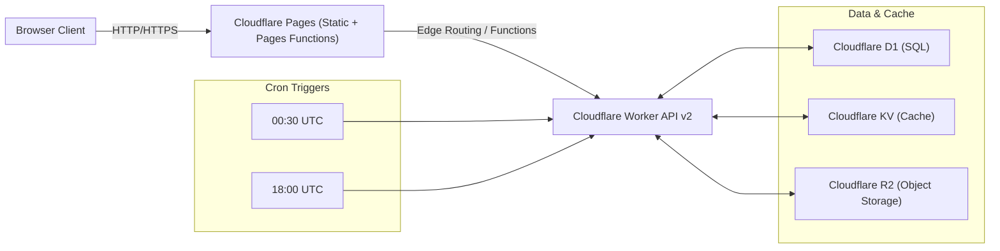

# 技術棧（已核對實際依賴與配置）

本文件依據實際 `package.json`、`vite.config.js`、`playwright.config.ts` 與 `backend/wrangler.toml` 產生，僅記載已使用之技術與準確版本範圍（不列未使用技術）。

## 核心總覽
- 前端：Vue 3、Ant Design Vue、Pinia、Vue Router、Axios、Day.js、Quill、pdfjs-dist
- 構建：Vite 5、@vitejs/plugin-vue、unplugin-auto-import、unplugin-vue-components、Terser
- 測試：Playwright（E2E，正式環境 URL 強制）
- 託管：Cloudflare Pages（靜態站點 + Pages Functions）
- 後端：Cloudflare Workers（API v2），Wrangler 管理
- 數據層：Cloudflare D1（SQL）、R2（物件儲存）、KV（快取）
- 排程：Workers Cron Triggers（每日 00:30 UTC、18:00 UTC）
- 自動化與工具：Spec Workflow MCP、MCP SDK、Tesseract.js（OCR 工具）

## 版本與依賴（來源：根目錄 package.json）
Frontend 依賴：
- @ant-design/icons-vue: ^7.0.1
- ant-design-vue: ^4.0.0
- axios: ^1.6.2
- dayjs: ^1.11.10
- pdfjs-dist: ^5.4.394
- pinia: ^2.1.7
- quill: ^2.0.3
- quill-better-table: ^1.2.10
- vue: ^3.3.4
- vue-router: ^4.2.5

Frontend 開發依賴：
- @modelcontextprotocol/sdk: ^1.0.4
- @playwright/test: ^1.40.0
- @pimzino/spec-workflow-mcp: ^2.0.6
- @types/node: ^20.10.5
- @vitejs/plugin-vue: ^4.5.0
- terser: ^5.44.1
- tesseract.js: ^5.1.0
- typescript: ^5.3.3
- unplugin-auto-import: ^20.2.0
- unplugin-vue-components: ^30.0.0
- vite: ^5.0.8

Backend 依賴（來源：backend/package.json）：
- @modelcontextprotocol/sdk: ^0.5.0
- undici: ^5.29.0

Backend 開發依賴：
- wrangler: ^4.47.0

版本說明：
- MCP SDK 在前端工具鏈使用 ^1.0.4，在後端 Worker 使用 ^0.5.0（後端橋接/管理腳本採用既有穩定版）。兩者用途不同，並非衝突。
- Playwright 僅作為 E2E 測試框架，不參與執行時。

## 前端架構
- 框架：Vue 3（組件式、Composition API）
- UI 元件庫：Ant Design Vue 4（按需載入，`unplugin-vue-components` + `AntDesignVueResolver`）
- 狀態管理：Pinia
- 路由：Vue Router 4
- HTTP：Axios
- 日期：Day.js
- 富文本：Quill（含 quill-better-table）
- PDF 檢視：pdfjs-dist
- 模組別名：`@` 指向 `src`（見 `vite.config.js`）
- 建置：Vite 5（`@vitejs/plugin-vue`，多組件/模組手動 chunk 拆分）

Vite 重點配置（已核對 `vite.config.js`）：
- Auto Import：`vue`、`vue-router`、`pinia`
- Components Resolver：Ant Design Vue，`importStyle: false`
- 手動分包策略：依第三方庫與業務模塊（e.g. `antd-icons`、`vue-core`、`views-*`、`components-*`、`api`、`utils`）
- 構建優化：`minify: esbuild`、`target: es2015`、`cssCodeSplit: true`

## 託管與邊緣層
- Cloudflare Pages：提供前端靜態檔案與 Pages Functions（目錄 `functions/`）
- Pages Functions：處理邊緣路由/中介（`functions/_middleware.js`、`functions/api/...`）
- 正式網域（測試基準）：`https://horgoscpa-internal-v2.pages.dev`
  - Playwright `baseURL` 預設指向上述正式域名（見 `playwright.config.ts`）

## 後端（API v2）
- 運行環境：Cloudflare Workers（`backend/`）
- Router/Handlers：位於 `backend/src/router/**`、`backend/src/handlers/**`
- 發佈與管理：Wrangler（`wrangler.toml`、scripts）
- 路由規則（`wrangler.toml`）：
  - `v2.horgoscpa.com/api/v2/*`（同 zone `horgoscpa.com`）
  - `v2.www.horgoscpa.com/api/v2/*`
- 兼容日期：`2024-01-01`
- 依賴：`undici`（HTTP 客戶端）

資料與快取（`wrangler.toml`）：
- D1：`DATABASE`（`horgoscpa-db-v2`，遷移目錄 `backend/migrations`）
- R2：`R2_BUCKET`（`horgoscpa-documents`）
- KV：`CACHE`（namespace id 已配置）
- Cron：每日 00:30 UTC 與 18:00 UTC（預先計算任務、薪資、報表、儀表板）

## 測試
- Playwright（`@playwright/test`）：
  - `baseURL`: `process.env.PLAYWRIGHT_BASE_URL || https://horgoscpa-internal-v2.pages.dev`
  - 強制保護：CI 或 `ENFORCE_PROD=1` 時禁止對非正式域名執行
  - 輸出報表：`playwright-report/`（含 `report.json`、HTML 報告）

## 自動化與開發工具
- Spec Workflow MCP：`@pimzino/spec-workflow-mcp`（Dashboard/Server 指令見根 `package.json` scripts）
- MCP SDK：前端工具鏈 ^1.0.4、後端橋接 ^0.5.0
- Tesseract.js：^5.1.0（OCR 工具用途）

## 架構圖



## 關鍵技術決策
- Vue 3 + Ant Design Vue：提升生產力與一致性；配合按需載入降低體積。
- Vite 5：快速開發與最佳化構建；手動分包對大型模塊更可控。
- 分層託管：前端採 Cloudflare Pages；後端獨立 Workers（清晰邊界、可獨立擴展與部署）。
- 資料層雲端化：D1（交易/結構化）、R2（檔案）、KV（快取）組合滿足成本與延遲需求。
- 嚴格 E2E 測試：Playwright 僅針對正式域名，避免環境不一致。
- MCP 生產力增強：規格、審批與自動化流程可追溯，避免散失。

## 風險與相容性
- MCP SDK 版本差異：前後端用途不同且各自穩定，需避免混用 API 類型。
- Cloudflare 兼容日期：升級需評估 Workers 行為變更。
- Vite/插件大版本升級：需一併驗證 AntD 按需載入與手動分包策略。

## 參考檔案
- `package.json`、`backend/package.json`
- `vite.config.js`
- `playwright.config.ts`
- `backend/wrangler.toml`

# Technology Stack

## Project Type
全端 Web 應用程式（Full-Stack Web Application）

這是一個會計師事務所內部管理系統，包含前端用戶界面和後端 API 服務，用於管理客戶、任務、財務、人力資源等業務流程。

---

## Core Technologies

### Primary Language(s)
- **JavaScript (ES6+)**: 主要開發語言
- **TypeScript**: 部分類型定義和工具使用
- **SQL**: 資料庫查詢語言

### Runtime/Compiler
- **Node.js**: 本地開發和構建工具
- **Cloudflare Workers Runtime**: 後端運行環境（基於 V8）
- **Vite**: 前端構建工具和開發伺服器

### Language-specific tools
- **npm**: 套件管理器
- **Vite**: 前端構建工具
- **Wrangler**: Cloudflare Workers 開發和部署工具

---

## Key Dependencies/Libraries

### 前端依賴
- **Vue 3.3.4**: 前端框架
- **Vue Router 4.2.5**: 路由管理
- **Pinia 2.1.7**: 狀態管理
- **Ant Design Vue 4.0.0**: UI 組件庫
- **@ant-design/icons-vue 7.0.1**: 圖標庫
- **Axios 1.6.2**: HTTP 客戶端
- **Day.js 1.11.10**: 日期處理
- **Quill 2.0.3**: 富文本編輯器
- **quill-better-table 1.2.10**: Quill 表格擴展
- **pdfjs-dist 5.4.394**: PDF 處理
- **tesseract.js 5.1.0**: OCR 文字識別

### 後端依賴
- **@modelcontextprotocol/sdk 0.5.0**: MCP 協議 SDK

### 開發依賴
- **@vitejs/plugin-vue 4.5.0**: Vite Vue 插件
- **unplugin-auto-import 20.2.0**: 自動導入工具
- **unplugin-vue-components 30.0.0**: 自動組件導入
- **TypeScript 5.3.3**: 類型檢查
- **@types/node 20.10.5**: Node.js 類型定義
- **terser 5.44.1**: JavaScript 壓縮工具
- **Wrangler 4.47.0**: Cloudflare Workers 工具

---

## Application Architecture

### 架構模式
**前後端分離架構 (Frontend-Backend Separation)**

- **前端**: 單頁應用程式 (SPA)，使用 Vue 3 構建
- **後端**: RESTful API 服務，運行在 Cloudflare Workers
- **通訊**: HTTP/HTTPS，使用 JSON 格式交換數據

### 前端架構
- **組件化開發**: 基於 Vue 3 Composition API
- **模組化路由**: 使用 Vue Router 進行路由管理
- **集中式狀態管理**: 使用 Pinia 管理應用狀態
- **API 層抽象**: 使用 Axios 封裝 API 調用
- **自動導入**: 使用 unplugin 自動導入 Vue API 和組件

### 後端架構
- **無伺服器架構**: 基於 Cloudflare Workers
- **模組化路由**: 使用自定義路由匹配器
- **中間件模式**: CORS、認證等中間件處理
- **Handler 模式**: 每個功能模組有獨立的 handler
- **工具函數分離**: 共用工具函數獨立管理

### 資料庫架構
- **關聯式資料庫**: Cloudflare D1 (基於 SQLite)
- **遷移管理**: 使用 Wrangler 進行資料庫遷移
- **索引優化**: 針對查詢需求建立適當索引
- **快取策略**: 使用 KV 和資料庫快取表提升效能

---

## Data Storage

### Primary storage
- **Cloudflare D1**: 主要資料庫，SQLite 相容
  - 用於儲存所有業務數據
  - 支援關聯式查詢
  - 自動備份和災難恢復

### Caching
- **Cloudflare KV**: 快速鍵值儲存
  - 用於 Session 管理
  - 用於快速快取查詢結果
  - 低延遲讀取

### File storage
- **Cloudflare R2**: 物件儲存服務
  - 用於儲存文件、圖片等靜態資源
  - 用於知識庫附件
  - 用於任務文件

### Data formats
- **JSON**: API 請求/響應格式
- **SQL**: 資料庫查詢語言
- **Markdown**: 部分文件內容格式（知識庫）

---

## External Integrations

### APIs
- **Cloudflare API**: 
  - Workers 部署管理
  - D1 資料庫管理
  - R2 儲存管理
  - KV 管理
  - Pages 部署管理

### Protocols
- **HTTP/REST**: 主要通訊協議
- **HTTPS**: 安全通訊協議
- **WebSocket**: 未來可能用於即時通知（目前未使用）

### Authentication
- **Session-based**: 基於 Cookie 的 Session 認證
- **Password Hashing**: 密碼雜湊儲存
- **Role-based Access Control (RBAC)**: 基於角色的權限控制

---

## Monitoring & Dashboard Technologies

### Dashboard Framework
- **Vue 3 + Ant Design Vue**: Web 儀表板
- **自定義組件**: 使用 Ant Design Vue 組件構建

### Real-time Communication
- **Polling**: 目前使用輪詢方式更新數據
- **未來規劃**: 可能使用 WebSocket 實現即時更新

### Visualization Libraries
- **Ant Design Vue Charts**: 使用 Ant Design Vue 內建圖表組件
- **自定義統計組件**: 基於 Ant Design Vue 組件自定義

### State Management
- **Pinia**: 前端狀態管理
- **資料庫快取表**: 後端狀態快取（DashboardDailySummary, ReportCache 等）

---

## Development Environment

### Build & Development Tools
- **Build System**: Vite (前端), Wrangler (後端)
- **Package Management**: npm
- **Development workflow**: 
  - 前端: Vite 開發伺服器，支援熱重載 (HMR)
  - 後端: Wrangler 本地開發，支援本地 D1 資料庫

### Code Quality Tools
- **Static Analysis**: 
  - ESLint (建議配置，目前未明確配置)
  - TypeScript 類型檢查（部分使用）
- **Formatting**: 
  - Prettier (建議配置，目前未明確配置)
- **Git Hooks**: 
  - 建議使用 Husky 進行提交前檢查

### Version Control
- **Git**: 版本控制系統
- **GitHub/GitLab**: 代碼倉庫（假設）

---

## Deployment & Infrastructure

### Frontend Deployment
- **Platform**: Cloudflare Pages
- **Build Command**: `npm run build`
- **Output Directory**: `dist`
- **Domain**: v2.horgoscpa.com (假設)

### Backend Deployment
- **Platform**: Cloudflare Workers
- **Deploy Command**: `wrangler deploy`
- **Runtime**: Cloudflare Workers Runtime (V8)
- **Edge Computing**: 全球邊緣節點部署

### Database
- **Platform**: Cloudflare D1
- **Type**: SQLite (相容)
- **Migration**: Wrangler D1 migrations
- **Backup**: Cloudflare 自動備份

### Storage
- **File Storage**: Cloudflare R2
- **Cache**: Cloudflare KV
- **CDN**: Cloudflare CDN (自動)

### CI/CD
- **自動化部署**: 
  - 使用 PowerShell 腳本 (`scripts/deploy.ps1`)
  - 使用 MCP 工具進行自動化部署
- **測試**: 
  - 使用 Playwright 進行 E2E 測試（部分）
  - 使用 Node.js 腳本進行 API 測試

---

## Security

### Authentication & Authorization
- **Session Management**: 基於 Cookie 的 Session
- **Password Security**: 密碼雜湊儲存
- **Role-based Access**: 管理員/一般用戶權限控制
- **Route Guards**: 前端路由守衛

### Data Security
- **HTTPS**: 強制使用 HTTPS
- **CORS**: 配置 CORS 策略
- **SQL Injection Prevention**: 使用參數化查詢
- **XSS Prevention**: Vue 自動轉義

### Infrastructure Security
- **Cloudflare Security**: DDoS 防護、WAF 等
- **Environment Variables**: 敏感資訊使用環境變數

---

## Performance Optimization

### Frontend Optimization
- **Code Splitting**: Vite 自動代碼分割
- **Lazy Loading**: 路由懶加載
- **Tree Shaking**: 自動移除未使用代碼
- **Asset Optimization**: 圖片、字體等資源優化
- **Bundle Optimization**: 手動配置 chunk 分割策略

### Backend Optimization
- **Edge Computing**: 全球邊緣節點，低延遲
- **Caching Strategy**: 
  - KV 快取
  - 資料庫快取表
  - 報表預先計算
- **Database Indexing**: 針對查詢建立索引
- **Batch Operations**: 批量處理減少請求次數

### Database Optimization
- **Indexes**: 針對常用查詢建立索引
- **Query Optimization**: 優化 SQL 查詢
- **Connection Pooling**: Cloudflare D1 自動管理

---

## Automation & Cron Jobs

### Scheduled Tasks
- **Cloudflare Cron Triggers**: 
  - 每日 00:30 UTC: 任務自動生成
  - 每日 18:00 UTC: 薪資計算、報表預先計算、儀表板摘要重建

### Task Automation
- **Task Generator**: 自動生成重複性任務
- **Payroll Calculation**: 自動計算薪資
- **Report Precomputation**: 自動預先計算報表
- **Dashboard Summary**: 自動重建儀表板摘要

---

## Development Workflow

### Local Development
1. **前端開發**:
   ```bash
   npm run dev  # 啟動 Vite 開發伺服器 (port 3000)
   ```

2. **後端開發**:
   ```bash
   cd backend
   npm run dev  # 啟動 Wrangler 本地開發 (port 8787)
   npm run migrate:local  # 本地資料庫遷移
   ```

### Testing
- **E2E Testing**: Playwright (部分測試)
- **API Testing**: Node.js 腳本 (`scripts/test-api-endpoints.js`)
- **Browser Testing**: 使用 Browser MCP 工具進行瀏覽器測試

### Deployment
- **自動化部署**: 使用 PowerShell 腳本
- **MCP 工具**: 使用 MCP 工具進行部署管理
- **驗證**: 部署後自動驗證

---

## Future Technology Considerations

### Potential Enhancements
- **TypeScript Migration**: 逐步遷移到 TypeScript
- **WebSocket Support**: 實現即時通知
- **GraphQL API**: 考慮使用 GraphQL 替代 REST
- **Microservices**: 如果規模擴大，考慮微服務架構
- **Testing Framework**: 完善單元測試和整合測試
- **Monitoring Tools**: 整合監控和日誌工具
- **CI/CD Pipeline**: 建立完整的 CI/CD 流程

### Scalability
- **Database Scaling**: D1 自動擴展
- **Worker Scaling**: Cloudflare Workers 自動擴展
- **CDN**: Cloudflare CDN 自動優化

---

## Summary

本專案採用現代化的技術棧，前端使用 Vue 3 + Ant Design Vue，後端使用 Cloudflare Workers，資料庫使用 Cloudflare D1，並整合了 R2 儲存和 KV 快取。架構設計注重效能、可擴展性和安全性，並充分利用 Cloudflare 的邊緣計算能力，實現全球低延遲的用戶體驗。


